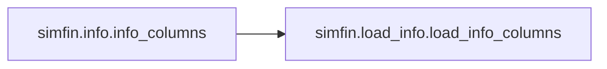
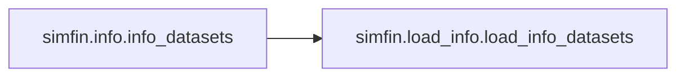

# Simfin Info

[_Documentation generated by Documatic_](https://www.documatic.com)

<!---Documatic-section-Codebase Structure-start--->
## Codebase Structure

<!---Documatic-block-system_architecture-start--->

<!---Documatic-block-system_architecture-end--->

# #
<!---Documatic-section-Codebase Structure-end--->

<!---Documatic-section-simfin.info.info_columns-start--->
## [simfin.info.info_columns](10-simfin_info.md#simfin.info.info_columns)

<!---Documatic-section-info_columns-start--->


### Object Calls

* simfin.load_info.load_info_columns

<!---Documatic-block-simfin.info.info_columns-start--->
<details>
	<summary><code>simfin.info.info_columns</code> code snippet</summary>

```python
def info_columns(search):
    if search is None or len(str(search).strip()) == 0:
        print('Please provide a valid search-string for the columns.')
    else:
        search = search.lower()
        info = load_info_columns()
        space_indent = '             '
        wrapper_datasets = TextWrapper(width=80, break_on_hyphens=False, break_long_words=False, initial_indent='Datasets:    ', subsequent_indent=space_indent)
        wrapper_shortcuts = TextWrapper(width=80, break_on_hyphens=False, break_long_words=False, initial_indent='Shortcuts:   ', subsequent_indent=space_indent)
        wrapper_descr = TextWrapper(width=80, initial_indent='Description: ', subsequent_indent=space_indent)
        num_found = 0
        for column in info:
            name = column['name']
            name_lower = name.lower()
            shortcuts = sorted(column['shortcuts'])
            shortcuts = ', '.join(shortcuts)
            shortcuts_lower = shortcuts.lower()
            descr = column['description'].strip()
            descr_lower = descr.lower()
            if search in name_lower or search in shortcuts_lower or search in descr_lower:
                num_found += 1
                is_premium = column['is_premium']
                print('Name:        "{0}"'.format(name))
                shortcuts = wrapper_shortcuts.wrap(shortcuts)
                print('\n'.join(shortcuts))
                print('Premium:    ', is_premium)
                datasets = sorted(column['datasets'])
                datasets = ', '.join(datasets)
                datasets = wrapper_datasets.wrap(datasets)
                print('\n'.join(datasets))
                if len(descr) == 0:
                    descr = '-'
                descr = wrapper_descr.wrap(descr)
                descr = '\n'.join(descr)
                print(descr)
                print()
        if num_found == 0:
            msg = "Search-text '{0}' was not found."
            msg = msg.format(search)
            print(msg)
```
</details>
<!---Documatic-block-simfin.info.info_columns-end--->
<!---Documatic-section-info_columns-end--->

# #
<!---Documatic-section-simfin.info.info_columns-end--->

<!---Documatic-section-simfin.info.info_datasets-start--->
## [simfin.info.info_datasets](10-simfin_info.md#simfin.info.info_datasets)

<!---Documatic-section-info_datasets-start--->


### Object Calls

* simfin.load_info.load_info_datasets

<!---Documatic-block-simfin.info.info_datasets-start--->
<details>
	<summary><code>simfin.info.info_datasets</code> code snippet</summary>

```python
def info_datasets(dataset=None, show_columns=True):
    info = load_info_datasets()
    if dataset is None:
        datasets = sorted(list(info))
        datasets = ', '.join(datasets)
        wrapper_datasets = TextWrapper(width=80, break_on_hyphens=False, break_long_words=False, initial_indent='All datasets: ', subsequent_indent='              ')
        datasets = wrapper_datasets.wrap(datasets)
        print('\n'.join(datasets))
    else:
        dataset = dataset.lower()
        x = info.get(dataset)
        if x is None:
            msg = "Dataset '{0}' not found."
            msg = msg.format(dataset)
            print(msg)
        else:
            print('Dataset: ', dataset)
            space_indent = '          '
            wrapper_variants = TextWrapper(width=80, initial_indent='Variants: ', subsequent_indent=space_indent)
            wrapper_markets = TextWrapper(width=80, initial_indent='Markets:  ', subsequent_indent=space_indent)
            variants = sorted(x['variants'])
            if len(variants) > 0:
                variants = ', '.join(variants)
            else:
                variants = '-'
            variants = wrapper_variants.wrap(variants)
            variants = '\n'.join(variants)
            print(variants)
            markets = sorted(x['markets'])
            if len(markets) > 0:
                markets = ', '.join(markets)
            else:
                markets = '-'
            markets = wrapper_markets.wrap(markets)
            markets = '\n'.join(markets)
            print(markets)
            if show_columns:
                print('Columns:  (The * marks data that requires a paid subscription)')
                wrapper_columns = TextWrapper(width=80, initial_indent='', subsequent_indent='   ')
                for column in x['columns']:
                    is_premium = '*' if column['is_premium'] else '-'
                    shortcuts = sorted(column['shortcuts'])
                    shortcuts = ', '.join(shortcuts)
                    msg = '{0} "{1}" {2}'
                    msg = msg.format(is_premium, column['name'], shortcuts)
                    msg = wrapper_columns.wrap(msg)
                    msg = '\n'.join(msg)
                    print(msg)
```
</details>
<!---Documatic-block-simfin.info.info_datasets-end--->
<!---Documatic-section-info_datasets-end--->

# #
<!---Documatic-section-simfin.info.info_datasets-end--->

[_Documentation generated by Documatic_](https://www.documatic.com)