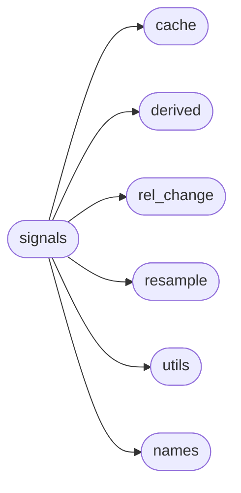
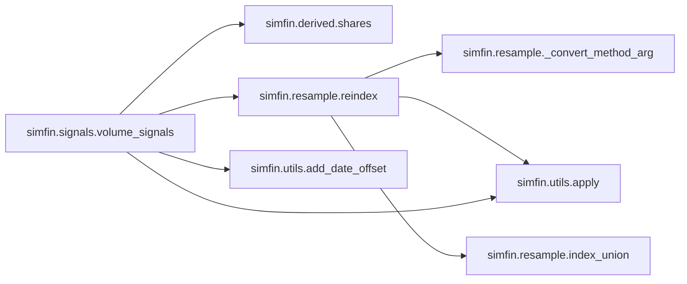
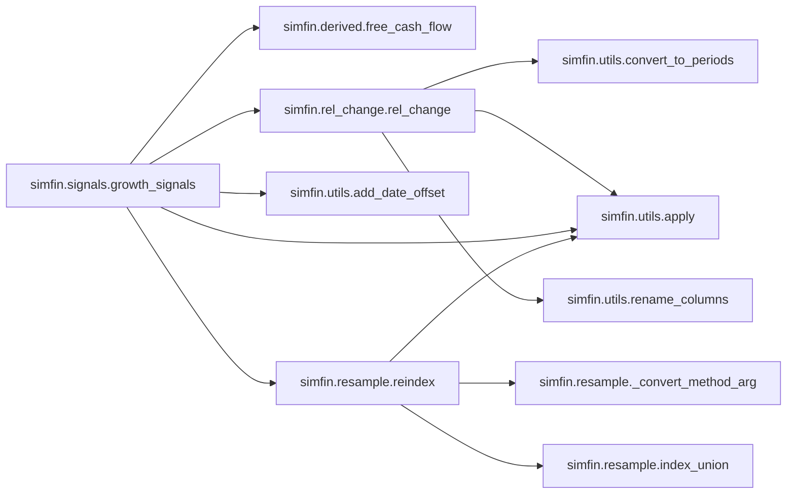
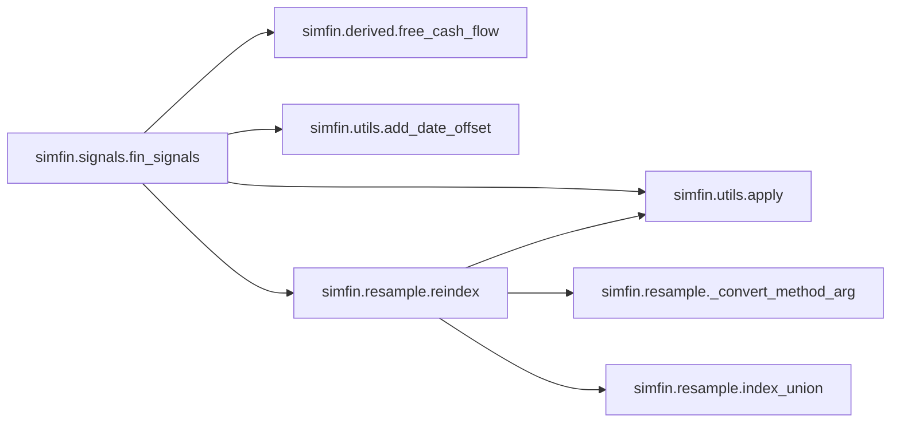
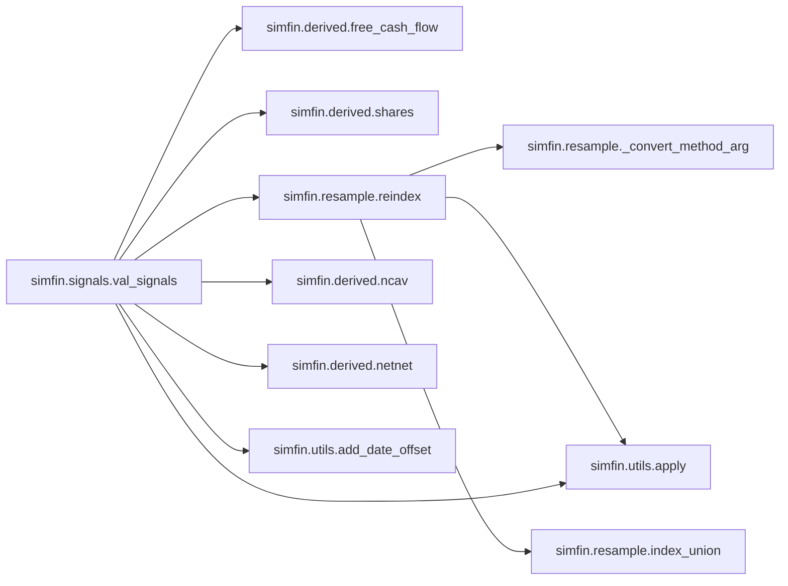

# Simfin Signals

[_Documentation generated by Documatic_](https://www.documatic.com)

<!---Documatic-section-Codebase Structure-start--->
## Codebase Structure

<!---Documatic-block-system_architecture-start--->

<!---Documatic-block-system_architecture-end--->

# #
<!---Documatic-section-Codebase Structure-end--->

<!---Documatic-section-simfin.signals.price_signals-start--->
## [simfin.signals.price_signals](11-simfin_signals.md#simfin.signals.price_signals)

<!---Documatic-section-price_signals-start--->


### Object Calls

* [simfin.utils.apply](3-simfin_utils.md#simfin.utils.apply)

<!---Documatic-block-simfin.signals.price_signals-start--->
<details>
	<summary><code>simfin.signals.price_signals</code> code snippet</summary>

```python
@cache
def price_signals(df_prices, group_index=TICKER):

    def _signals(df_prices):
        df_signals = pd.DataFrame(index=df_prices.index)
        df_price = df_prices[CLOSE]
        df_signals[MAVG_20] = df_price.rolling(window=20).mean()
        df_signals[MAVG_200] = df_price.rolling(window=200).mean()
        df_signals[EMA] = df_price.ewm(span=20).mean()
        df_signals[MACD] = df_price.ewm(span=12).mean() - df_price.ewm(span=26).mean()
        df_signals[MACD_EMA] = df_signals[MACD].ewm(span=9).mean()
        return df_signals
    df_signals = apply(df=df_prices, func=_signals, group_index=group_index)
    df_signals.sort_index(axis='columns', inplace=True)
    return df_signals
```
</details>
<!---Documatic-block-simfin.signals.price_signals-end--->
<!---Documatic-section-price_signals-end--->

# #
<!---Documatic-section-simfin.signals.price_signals-end--->

<!---Documatic-section-simfin.signals.volume_signals-start--->
## [simfin.signals.volume_signals](11-simfin_signals.md#simfin.signals.volume_signals)

<!---Documatic-section-volume_signals-start--->


### Object Calls

* [simfin.derived.shares](12-simfin_derived.md#simfin.derived.shares)
* [simfin.resample.reindex](9-simfin_resample.md#simfin.resample.reindex)
* [simfin.utils.apply](3-simfin_utils.md#simfin.utils.apply)
* [simfin.utils.add_date_offset](3-simfin_utils.md#simfin.utils.add_date_offset)

<!---Documatic-block-simfin.signals.volume_signals-start--->
<details>
	<summary><code>simfin.signals.volume_signals</code> code snippet</summary>

```python
@cache
def volume_signals(df_prices, df_shares, window=20, fill_method='ffill', offset=None, date_index=REPORT_DATE, shares_index=SHARES_BASIC, group_index=TICKER):
    df_shares = shares(df=df_shares, index=shares_index)

    def _signals(df):
        df_signals = pd.DataFrame(index=df.index)
        df_price = df[CLOSE]
        df_volume = df[VOLUME]
        df_shares_daily = df[shares_index]
        df_volume_mavg = df_volume.rolling(window=window).mean()
        df_rel_vol = df_volume / df_volume_mavg
        df_signals[REL_VOL] = np.log(df_rel_vol)
        df_vol_mcap = df_volume * df_price
        df_signals[VOLUME_MCAP] = df_vol_mcap.rolling(window=window).mean()
        df_vol_turn = df_volume / df_shares_daily
        df_signals[VOLUME_TURNOVER] = df_vol_turn.rolling(window=window).mean()
        return df_signals
    if offset is not None:
        df_shares = add_date_offset(df=df_shares, offset=offset, date_index=date_index)
    df_shares_daily = reindex(df_src=df_shares, df_target=df_prices, method=fill_method, group_index=group_index)
    dfs = [df_prices[[CLOSE, VOLUME]], df_shares_daily]
    df = pd.concat(dfs, axis=1)
    df_signals = apply(df=df, func=_signals, group_index=group_index)
    df_signals.sort_index(axis='columns', inplace=True)
    return df_signals
```
</details>
<!---Documatic-block-simfin.signals.volume_signals-end--->
<!---Documatic-section-volume_signals-end--->

# #
<!---Documatic-section-simfin.signals.volume_signals-end--->

<!---Documatic-section-simfin.signals.growth_signals-start--->
## [simfin.signals.growth_signals](11-simfin_signals.md#simfin.signals.growth_signals)

<!---Documatic-section-growth_signals-start--->


### Object Calls

* [simfin.derived.free_cash_flow](12-simfin_derived.md#simfin.derived.free_cash_flow)
* simfin.rel_change.rel_change
* [simfin.utils.add_date_offset](3-simfin_utils.md#simfin.utils.add_date_offset)
* [simfin.utils.apply](3-simfin_utils.md#simfin.utils.apply)
* [simfin.resample.reindex](9-simfin_resample.md#simfin.resample.reindex)

<!---Documatic-block-simfin.signals.growth_signals-start--->
<details>
	<summary><code>simfin.signals.growth_signals</code> code snippet</summary>

```python
@cache
def growth_signals(df_income_ttm, df_income_qrt, df_balance_ttm, df_balance_qrt, df_cashflow_ttm, df_cashflow_qrt, df_prices=None, fill_method='ffill', offset=None, func=None, date_index=REPORT_DATE, group_index=TICKER):
    df_ttm1 = df_income_ttm[[REVENUE, NET_INCOME]]
    df_ttm2 = free_cash_flow(df_cashflow_ttm)
    df_ttm3 = df_balance_ttm[[TOTAL_ASSETS]]
    df_ttm = pd.concat([df_ttm1, df_ttm2, df_ttm3], axis=1)
    new_names = {REVENUE: SALES_GROWTH, NET_INCOME: EARNINGS_GROWTH, FCF: FCF_GROWTH, TOTAL_ASSETS: ASSETS_GROWTH}
    df_growth = rel_change(df=df_ttm, freq='q', quarters=4, future=False, annualized=False, new_names=new_names)
    df_qrt1 = df_income_qrt[[REVENUE, NET_INCOME]]
    df_qrt2 = free_cash_flow(df_cashflow_qrt)
    df_qrt3 = df_balance_qrt[[TOTAL_ASSETS]]
    df_qrt = pd.concat([df_qrt1, df_qrt2, df_qrt3], axis=1)
    new_names = {REVENUE: SALES_GROWTH_YOY, NET_INCOME: EARNINGS_GROWTH_YOY, FCF: FCF_GROWTH_YOY, TOTAL_ASSETS: ASSETS_GROWTH_YOY}
    df_growth_yoy = rel_change(df=df_qrt, freq='q', quarters=4, future=False, annualized=False, new_names=new_names)
    new_names = {REVENUE: SALES_GROWTH_QOQ, NET_INCOME: EARNINGS_GROWTH_QOQ, FCF: FCF_GROWTH_QOQ, TOTAL_ASSETS: ASSETS_GROWTH_QOQ}
    df_growth_qoq = rel_change(df=df_qrt, freq='q', quarters=1, future=False, annualized=False, new_names=new_names)
    df_signals = pd.concat([df_growth, df_growth_yoy, df_growth_qoq], axis=1)
    if offset is not None:
        df_signals = add_date_offset(df=df_signals, offset=offset, date_index=date_index)
    if func is not None:
        df_signals = apply(df=df_signals, func=func, group_index=group_index)
    if df_prices is not None:
        df_signals = reindex(df_src=df_signals, df_target=df_prices, method=fill_method, group_index=group_index)
    df_signals.sort_index(axis='columns', inplace=True)
    return df_signals
```
</details>
<!---Documatic-block-simfin.signals.growth_signals-end--->
<!---Documatic-section-growth_signals-end--->

# #
<!---Documatic-section-simfin.signals.growth_signals-end--->

<!---Documatic-section-simfin.signals.fin_signals-start--->
## [simfin.signals.fin_signals](11-simfin_signals.md#simfin.signals.fin_signals)

<!---Documatic-section-fin_signals-start--->


### Object Calls

* [simfin.derived.free_cash_flow](12-simfin_derived.md#simfin.derived.free_cash_flow)
* [simfin.utils.apply](3-simfin_utils.md#simfin.utils.apply)
* [simfin.utils.add_date_offset](3-simfin_utils.md#simfin.utils.add_date_offset)
* [simfin.resample.reindex](9-simfin_resample.md#simfin.resample.reindex)

<!---Documatic-block-simfin.signals.fin_signals-start--->
<details>
	<summary><code>simfin.signals.fin_signals</code> code snippet</summary>

```python
@cache
def fin_signals(df_income_ttm, df_balance_ttm, df_cashflow_ttm, df_prices=None, offset=None, func=None, fill_method='ffill', date_index=REPORT_DATE, group_index=TICKER, banks=False, insurance=False):

    def _signals(df):
        df_signals = pd.DataFrame(index=df.index)
        df_signals[NET_PROFIT_MARGIN] = df[NET_INCOME] / df[REVENUE]
        if not banks and (not insurance):
            df_signals[GROSS_PROFIT_MARGIN] = df[GROSS_PROFIT] / df[REVENUE]
        if not banks and (not insurance):
            df_signals[RD_REVENUE] = -df[RESEARCH_DEV] / df[REVENUE]
        if not banks and (not insurance):
            df_signals[RD_GROSS_PROFIT] = -df[RESEARCH_DEV] / df[GROSS_PROFIT]
        if not banks and (not insurance):
            df_signals[RORC] = df[GROSS_PROFIT] / -df[RESEARCH_DEV]
        if not banks and (not insurance):
            df_signals[INTEREST_COV] = df[OPERATING_INCOME] / -df[INTEREST_EXP_NET]
        if not banks and (not insurance):
            df_signals[CURRENT_RATIO] = df[TOTAL_CUR_ASSETS] / df[TOTAL_CUR_LIAB]
        if not banks and (not insurance):
            df_signals[QUICK_RATIO] = (df[CASH_EQUIV_ST_INVEST] + df[ACC_NOTES_RECV].fillna(0.0)) / df[TOTAL_CUR_LIAB]
        df_signals[DEBT_RATIO] = (df[ST_DEBT] + df[LT_DEBT]) / df[TOTAL_ASSETS]
        df_signals[ROA] = df[NET_INCOME] / df[TOTAL_ASSETS]
        df_signals[ROE] = df[NET_INCOME] / df[TOTAL_EQUITY]
        df_signals[ASSET_TURNOVER] = df[REVENUE] / df[TOTAL_ASSETS]
        if not banks and (not insurance):
            df_signals[INVENTORY_TURNOVER] = df[REVENUE] / df[INVENTORIES]
        df_signals[PAYOUT_RATIO] = -df[DIVIDENDS_PAID].fillna(0) / df[FCF]
        df_signals[BUYBACK_RATIO] = -df[CASH_REPURCHASE_EQUITY].fillna(0) / df[FCF]
        df_signals[PAYOUT_BUYBACK_RATIO] = -(df[DIVIDENDS_PAID].fillna(0) + df[CASH_REPURCHASE_EQUITY].fillna(0)) / df[FCF]
        if not insurance:
            df_signals[ACQ_ASSETS_RATIO] = -df[NET_CASH_ACQ_DIVEST] / df[TOTAL_ASSETS]
        df_signals[CAPEX_DEPR_RATIO] = -df[CAPEX] / df[DEPR_AMOR]
        df_signals[LOG_REVENUE] = np.log10(df[REVENUE])
        return df_signals
    if banks or insurance:
        columns = [REVENUE, OPERATING_INCOME, NET_INCOME]
    else:
        columns = [REVENUE, GROSS_PROFIT, OPERATING_INCOME, INTEREST_EXP_NET, NET_INCOME, RESEARCH_DEV]
    df1 = df_income_ttm[columns]
    if banks or insurance:
        columns = [TOTAL_ASSETS, TOTAL_EQUITY, ST_DEBT, LT_DEBT]
    else:
        columns = [TOTAL_ASSETS, TOTAL_CUR_ASSETS, TOTAL_CUR_LIAB, TOTAL_EQUITY, ST_DEBT, LT_DEBT, INVENTORIES, CASH_EQUIV_ST_INVEST, ACC_NOTES_RECV]
    df2 = df_balance_ttm[columns]
    if banks:
        columns = [DIVIDENDS_PAID, CASH_REPURCHASE_EQUITY, NET_CASH_ACQ_DIVEST, CAPEX, DEPR_AMOR]
    elif insurance:
        columns = [DIVIDENDS_PAID, CASH_REPURCHASE_EQUITY, CAPEX, DEPR_AMOR]
    else:
        columns = [DIVIDENDS_PAID, CASH_REPURCHASE_EQUITY, NET_CASH_ACQ_DIVEST, CAPEX, DEPR_AMOR]
    df3 = df_cashflow_ttm[columns]
    df_fcf = free_cash_flow(df_cashflow=df_cashflow_ttm)
    df = pd.concat([df1, df2, df3, df_fcf], axis=1)
    if offset is not None:
        df = add_date_offset(df=df, offset=offset, date_index=date_index)
    df_signals = apply(df=df, func=_signals, group_index=group_index)
    if func is not None:
        df_signals = apply(df=df_signals, func=func, group_index=group_index)
    if df_prices is not None:
        df_signals = reindex(df_src=df_signals, df_target=df_prices, method=fill_method, group_index=group_index)
    df_signals.sort_index(axis='columns', inplace=True)
    return df_signals
```
</details>
<!---Documatic-block-simfin.signals.fin_signals-end--->
<!---Documatic-section-fin_signals-end--->

# #
<!---Documatic-section-simfin.signals.fin_signals-end--->

<!---Documatic-section-simfin.signals.val_signals-start--->
## [simfin.signals.val_signals](11-simfin_signals.md#simfin.signals.val_signals)

<!---Documatic-section-val_signals-start--->


### Object Calls

* [simfin.derived.free_cash_flow](12-simfin_derived.md#simfin.derived.free_cash_flow)
* [simfin.derived.shares](12-simfin_derived.md#simfin.derived.shares)
* [simfin.resample.reindex](9-simfin_resample.md#simfin.resample.reindex)
* [simfin.derived.ncav](12-simfin_derived.md#simfin.derived.ncav)
* [simfin.derived.netnet](12-simfin_derived.md#simfin.derived.netnet)
* [simfin.utils.add_date_offset](3-simfin_utils.md#simfin.utils.add_date_offset)
* [simfin.utils.apply](3-simfin_utils.md#simfin.utils.apply)

<!---Documatic-block-simfin.signals.val_signals-start--->
<details>
	<summary><code>simfin.signals.val_signals</code> code snippet</summary>

```python
@cache
def val_signals(df_prices, df_income_ttm, df_balance_ttm, df_cashflow_ttm, fill_method='ffill', offset=None, func=None, date_index=REPORT_DATE, shares_index=SHARES_DILUTED, group_index=TICKER, banks=False, insurance=False):
    columns = [REVENUE, NET_INCOME_COMMON, SHARES_BASIC, SHARES_DILUTED]
    df_inc = df_income_ttm[columns]
    if banks or insurance:
        columns = [TOTAL_ASSETS, TOTAL_LIABILITIES, TOTAL_EQUITY]
    else:
        columns = [TOTAL_CUR_ASSETS, CASH_EQUIV_ST_INVEST, ACC_NOTES_RECV, INVENTORIES, TOTAL_LIABILITIES, TOTAL_EQUITY]
    df_bal = df_balance_ttm[columns]
    columns = [DIVIDENDS_PAID]
    df_cf = df_cashflow_ttm[columns]
    df = pd.concat([df_inc, df_bal, df_cf], axis=1)
    df[FCF] = free_cash_flow(df_cashflow_ttm)
    if not banks and (not insurance):
        df[NCAV] = ncav(df_balance_ttm)
    if not banks and (not insurance):
        df[NETNET] = netnet(df_balance_ttm)
    if offset is not None:
        df = add_date_offset(df=df, offset=offset, date_index=date_index)
    df_shares = shares(df=df, index=shares_index)
    df_shares_daily = reindex(df_src=df_shares, df_target=df_prices, method=fill_method, group_index=group_index)
    if func is not None:
        df = apply(df=df, func=func, group_index=group_index)
    df_per_share = df.div(df_shares, axis=0)
    df_daily = reindex(df_src=df_per_share, df_target=df_prices, method=fill_method, group_index=group_index)
    df_signals = pd.DataFrame(index=df_prices.index)
    df_price = df_prices[CLOSE]
    df_signals[PSALES] = df_price / df_daily[REVENUE]
    df_signals[PE] = df_price / df_daily[NET_INCOME_COMMON]
    df_signals[PFCF] = df_price / df_daily[FCF]
    df_signals[PBOOK] = df_price / df_daily[TOTAL_EQUITY]
    if not banks and (not insurance):
        df_signals[P_NCAV] = df_price / df_daily[NCAV]
    if not banks and (not insurance):
        df_signals[P_NETNET] = df_price / df_daily[NETNET]
    if not banks and (not insurance):
        df_signals[P_CASH] = df_price / df_daily[CASH_EQUIV_ST_INVEST]
    df_signals[EARNINGS_YIELD] = df_daily[NET_INCOME_COMMON] / df_price
    df_signals[FCF_YIELD] = df_daily[FCF] / df_price
    df_signals[DIV_YIELD] = -df_daily[DIVIDENDS_PAID] / df_price
    df_signals[MARKET_CAP] = df_shares_daily * df_price
    df_signals.sort_index(axis='columns', inplace=True)
    return df_signals
```
</details>
<!---Documatic-block-simfin.signals.val_signals-end--->
<!---Documatic-section-val_signals-end--->

# #
<!---Documatic-section-simfin.signals.val_signals-end--->

<!---Documatic-section-simfin.signals.trade_signals-start--->
## [simfin.signals.trade_signals](11-simfin_signals.md#simfin.signals.trade_signals)

<!---Documatic-section-trade_signals-start--->


### Object Calls

* [simfin.utils.apply](3-simfin_utils.md#simfin.utils.apply)

<!---Documatic-block-simfin.signals.trade_signals-start--->
<details>
	<summary><code>simfin.signals.trade_signals</code> code snippet</summary>

```python
@cache
def trade_signals(df, signal1, signal2, group_index=TICKER):

    def _signals(df):
        df_signals = pd.DataFrame(index=df.index)
        df_above = df[signal1] >= df[signal2]
        df_signals[BUY] = df_above & ~df_above.shift(1, fill_value=True)
        df_signals[SELL] = ~df_above & df_above.shift(1, fill_value=False)
        df_signals[HOLD] = df_above
        return df_signals
    df_signals = apply(df=df, func=_signals, group_index=group_index)
    df_signals.sort_index(axis='columns', inplace=True)
    return df_signals
```
</details>
<!---Documatic-block-simfin.signals.trade_signals-end--->
<!---Documatic-section-trade_signals-end--->

# #
<!---Documatic-section-simfin.signals.trade_signals-end--->

[_Documentation generated by Documatic_](https://www.documatic.com)