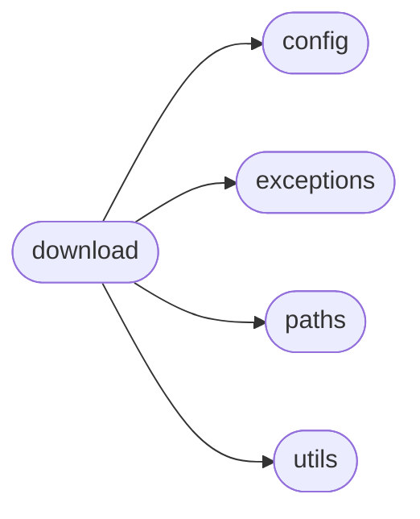

# Simfin Download

[_Documentation generated by Documatic_](https://www.documatic.com)

<!---Documatic-section-Codebase Structure-start--->
## Codebase Structure

<!---Documatic-block-system_architecture-start--->

<!---Documatic-block-system_architecture-end--->

# #
<!---Documatic-section-Codebase Structure-end--->

<!---Documatic-section-simfin.download._maybe_download_dataset-start--->
## [simfin.download._maybe_download_dataset](13-simfin_download.md#simfin.download._maybe_download_dataset)

<!---Documatic-section-_maybe_download_dataset-start--->


### Object Calls

* [simfin.paths._filename_dataset](7-simfin_paths.md#simfin.paths._filename_dataset)
* [simfin.paths._path_dataset](7-simfin_paths.md#simfin.paths._path_dataset)
* simfin.paths._path_download_dataset
* simfin.download._url_dataset
* simfin.download._maybe_download

<!---Documatic-block-simfin.download._maybe_download_dataset-start--->
<details>
	<summary><code>simfin.download._maybe_download_dataset</code> code snippet</summary>

```python
def _maybe_download_dataset(refresh_days, **kwargs):
    dataset_name = _filename_dataset(**kwargs, extension=None)
    path = _path_dataset(**kwargs)
    download_path = _path_download_dataset(**kwargs)
    url = _url_dataset(**kwargs)
    return _maybe_download(name=dataset_name, path=path, download_path=download_path, url=url, refresh_days=refresh_days)
```
</details>
<!---Documatic-block-simfin.download._maybe_download_dataset-end--->
<!---Documatic-section-_maybe_download_dataset-end--->

# #
<!---Documatic-section-simfin.download._maybe_download_dataset-end--->

[_Documentation generated by Documatic_](https://www.documatic.com)