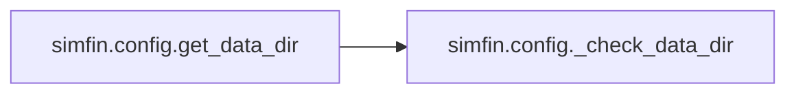
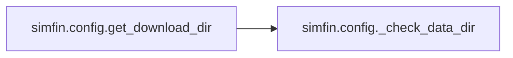
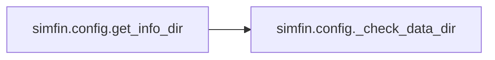

# Simfin Config

[_Documentation generated by Documatic_](https://www.documatic.com)

<!---Documatic-section-Codebase Structure-start--->
## Codebase Structure

<!---Documatic-block-system_architecture-start--->
```mermaid
None
```
<!---Documatic-block-system_architecture-end--->

# #
<!---Documatic-section-Codebase Structure-end--->

<!---Documatic-section-simfin.config.get_data_dir-start--->
## [simfin.config.get_data_dir](15-simfin_config.md#simfin.config.get_data_dir)

<!---Documatic-section-get_data_dir-start--->


### Object Calls

* [simfin.config._check_data_dir](15-simfin_config.md#simfin.config._check_data_dir)

<!---Documatic-block-simfin.config.get_data_dir-start--->
<details>
	<summary><code>simfin.config.get_data_dir</code> code snippet</summary>

```python
def get_data_dir():
    _check_data_dir()
    return _data_dir
```
</details>
<!---Documatic-block-simfin.config.get_data_dir-end--->
<!---Documatic-section-get_data_dir-end--->

# #
<!---Documatic-section-simfin.config.get_data_dir-end--->

<!---Documatic-section-simfin.config.get_download_dir-start--->
## [simfin.config.get_download_dir](15-simfin_config.md#simfin.config.get_download_dir)

<!---Documatic-section-get_download_dir-start--->


### Object Calls

* [simfin.config._check_data_dir](15-simfin_config.md#simfin.config._check_data_dir)

<!---Documatic-block-simfin.config.get_download_dir-start--->
<details>
	<summary><code>simfin.config.get_download_dir</code> code snippet</summary>

```python
def get_download_dir():
    _check_data_dir()
    return _download_dir
```
</details>
<!---Documatic-block-simfin.config.get_download_dir-end--->
<!---Documatic-section-get_download_dir-end--->

# #
<!---Documatic-section-simfin.config.get_download_dir-end--->

<!---Documatic-section-simfin.config.set_api_key-start--->
## [simfin.config.set_api_key](15-simfin_config.md#simfin.config.set_api_key)

<!---Documatic-section-set_api_key-start--->
<!---Documatic-block-simfin.config.set_api_key-start--->
<details>
	<summary><code>simfin.config.set_api_key</code> code snippet</summary>

```python
def set_api_key(api_key='free'):
    global _api_key
    _api_key = api_key
```
</details>
<!---Documatic-block-simfin.config.set_api_key-end--->
<!---Documatic-section-set_api_key-end--->

# #
<!---Documatic-section-simfin.config.set_api_key-end--->

<!---Documatic-section-simfin.config.get_api_key-start--->
## [simfin.config.get_api_key](15-simfin_config.md#simfin.config.get_api_key)

<!---Documatic-section-get_api_key-start--->
<!---Documatic-block-simfin.config.get_api_key-start--->
<details>
	<summary><code>simfin.config.get_api_key</code> code snippet</summary>

```python
def get_api_key():
    return _api_key
```
</details>
<!---Documatic-block-simfin.config.get_api_key-end--->
<!---Documatic-section-get_api_key-end--->

# #
<!---Documatic-section-simfin.config.get_api_key-end--->

<!---Documatic-section-simfin.config.load_api_key-start--->
## [simfin.config.load_api_key](15-simfin_config.md#simfin.config.load_api_key)

<!---Documatic-section-load_api_key-start--->


### Object Calls

* [simfin.config.set_api_key](15-simfin_config.md#simfin.config.set_api_key)

<!---Documatic-block-simfin.config.load_api_key-start--->
<details>
	<summary><code>simfin.config.load_api_key</code> code snippet</summary>

```python
def load_api_key(path='~/simfin_api_key.txt', default_key='free'):
    try:
        path = os.path.expanduser(path)
        with open(path) as f:
            key = f.readline().strip()
    except:
        key = default_key
    set_api_key(api_key=key)
```
</details>
<!---Documatic-block-simfin.config.load_api_key-end--->
<!---Documatic-section-load_api_key-end--->

# #
<!---Documatic-section-simfin.config.load_api_key-end--->

<!---Documatic-section-simfin.config.set_data_dir-start--->
## [simfin.config.set_data_dir](15-simfin_config.md#simfin.config.set_data_dir)

<!---Documatic-section-set_data_dir-start--->
<!---Documatic-block-simfin.config.set_data_dir-start--->
<details>
	<summary><code>simfin.config.set_data_dir</code> code snippet</summary>

```python
def set_data_dir(data_dir='~/simfin_data/'):
    global _data_dir, _download_dir, _cache_dir, _info_dir
    _data_dir = os.path.expanduser(data_dir)
    _download_dir = os.path.join(_data_dir, 'download/')
    _cache_dir = os.path.join(_data_dir, 'cache/')
    _info_dir = os.path.join(_data_dir, 'info/')
    if not os.path.exists(_download_dir):
        os.makedirs(_download_dir)
    if not os.path.exists(_cache_dir):
        os.makedirs(_cache_dir)
    if not os.path.exists(_info_dir):
        os.makedirs(_info_dir)
```
</details>
<!---Documatic-block-simfin.config.set_data_dir-end--->
<!---Documatic-section-set_data_dir-end--->

# #
<!---Documatic-section-simfin.config.set_data_dir-end--->

<!---Documatic-section-simfin.config.get_info_dir-start--->
## [simfin.config.get_info_dir](15-simfin_config.md#simfin.config.get_info_dir)

<!---Documatic-section-get_info_dir-start--->


### Object Calls

* [simfin.config._check_data_dir](15-simfin_config.md#simfin.config._check_data_dir)

<!---Documatic-block-simfin.config.get_info_dir-start--->
<details>
	<summary><code>simfin.config.get_info_dir</code> code snippet</summary>

```python
def get_info_dir():
    _check_data_dir()
    return _info_dir
```
</details>
<!---Documatic-block-simfin.config.get_info_dir-end--->
<!---Documatic-section-get_info_dir-end--->

# #
<!---Documatic-section-simfin.config.get_info_dir-end--->

<!---Documatic-section-simfin.config._check_data_dir-start--->
## [simfin.config._check_data_dir](15-simfin_config.md#simfin.config._check_data_dir)

<!---Documatic-section-_check_data_dir-start--->
<!---Documatic-block-simfin.config._check_data_dir-start--->
<details>
	<summary><code>simfin.config._check_data_dir</code> code snippet</summary>

```python
def _check_data_dir():
    if _data_dir is None:
        msg = 'The simfin data directory has not been set by the user. Please call the function sf.set_data_dir() first.'
        raise Exception(msg)
```
</details>
<!---Documatic-block-simfin.config._check_data_dir-end--->
<!---Documatic-section-_check_data_dir-end--->

# #
<!---Documatic-section-simfin.config._check_data_dir-end--->

[_Documentation generated by Documatic_](https://www.documatic.com)