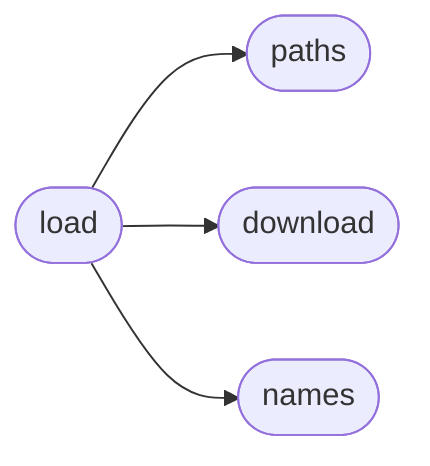

# Simfin Load

[_Documentation generated by Documatic_](https://www.documatic.com)

<!---Documatic-section-Codebase Structure-start--->
## Codebase Structure

<!---Documatic-block-system_architecture-start--->

<!---Documatic-block-system_architecture-end--->

# #
<!---Documatic-section-Codebase Structure-end--->

<!---Documatic-section-simfin.load.load-start--->
## [simfin.load.load](16-simfin_load.md#simfin.load.load)

<!---Documatic-section-load-start--->


### Object Calls

* [simfin.download._maybe_download_dataset](13-simfin_download.md#simfin.download._maybe_download_dataset)
* [simfin.paths._path_dataset](7-simfin_paths.md#simfin.paths._path_dataset)

<!---Documatic-block-simfin.load.load-start--->
<details>
	<summary><code>simfin.load.load</code> code snippet</summary>

```python
def load(dataset, variant=None, market=None, parse_dates=None, index=None, refresh_days=30):
    assert dataset is not None
    dataset = dataset.lower()
    if variant is not None:
        variant = variant.lower()
    if market is not None:
        market = market.lower()
    dataset_args = {'dataset': dataset, 'variant': variant, 'market': market}
    _maybe_download_dataset(**dataset_args, refresh_days=refresh_days)
    date_parser = lambda x: pd.to_datetime(x, yearfirst=True, dayfirst=False)
    print('- Loading from disk ... ', end='')
    path = _path_dataset(**dataset_args)
    df = pd.read_csv(path, sep=';', header=0, parse_dates=parse_dates, date_parser=date_parser)
    if index is not None:
        df.set_index(index, inplace=True)
        df.sort_index(ascending=True, inplace=True)
    print('Done!')
    return df
```
</details>
<!---Documatic-block-simfin.load.load-end--->
<!---Documatic-section-load-end--->

# #
<!---Documatic-section-simfin.load.load-end--->

[_Documentation generated by Documatic_](https://www.documatic.com)