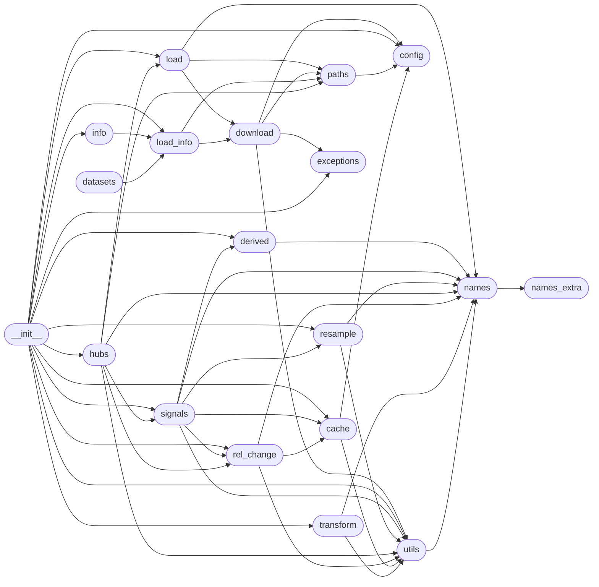

# Code Overview

[_Documentation generated by Documatic_](https://www.documatic.com)

<!---Documatic-section-Codebase Structure Python-start--->
## Codebase Structure Python

The codebase has a flat structure, with 19 code files.

<!---Documatic-block-system_architecture-start--->

<!---Documatic-block-system_architecture-end--->

# #
<!---Documatic-section-Codebase Structure Python-end--->

<!---Documatic-section-Key Objects-start--->
## Key Objects

There are exposed imports at level-0
from the source directory (simfin)

<!---Documatic-block-simf-start--->

	
<code>simf</code> (Click to Expand!)

* `simfin.cache.cache`
* `simfin.config.get_api_key`
* `simfin.config.get_data_dir`
* `simfin.config.get_download_dir`
* `simfin.config.load_api_key`
* `simfin.config.set_api_key`
* `simfin.config.set_data_dir`
* `simfin.derived.ebitda`
* `simfin.derived.free_cash_flow`
* `simfin.derived.shares`
* `simfin.exceptions.ServerException`
* `simfin.hubs.StockHub`
* `simfin.info.info_columns`
* `simfin.info.info_datasets`
* `simfin.load.load`
* `simfin.load.load_balance`
* `simfin.load.load_balance_banks`
* `simfin.load.load_balance_insurance`
* `simfin.load.load_cashflow`
* `simfin.load.load_cashflow_banks`
* `simfin.load.load_cashflow_insurance`
* `simfin.load.load_companies`
* `simfin.load.load_derived`
* `simfin.load.load_derived_banks`
* `simfin.load.load_derived_insurance`
* `simfin.load.load_derived_shareprices`
* `simfin.load.load_income`
* `simfin.load.load_income_banks`
* `simfin.load.load_income_insurance`
* `simfin.load.load_industries`
* `simfin.load.load_markets`
* `simfin.load.load_shareprices`
* `simfin.load_info.load_info_columns`
* `simfin.load_info.load_info_datasets`
* `simfin.rel_change.mean_log_change`
* `simfin.rel_change.rel_change`
* `simfin.resample.asfreq`
* `simfin.resample.asfreq_daily`
* `simfin.resample.index_union`
* `simfin.resample.reindex`
* `simfin.resample.resample`
* `simfin.resample.resample_daily`
* `simfin.signals.fin_signals`
* `simfin.signals.growth_signals`
* `simfin.signals.price_signals`
* `simfin.signals.trade_signals`
* `simfin.signals.val_signals`
* `simfin.signals.volume_signals`
* `simfin.transform.avg_ttm`
* `simfin.transform.avg_ttm_2y`
* `simfin.transform.avg_ttm_3y`
* `simfin.transform.clip`
* `simfin.transform.max_drawdown`
* `simfin.transform.moving_zscore`
* `simfin.transform.rel_change_ttm_1y`
* `simfin.transform.rel_change_ttm_2y`
* `simfin.transform.winsorize`
* `simfin.utils.add_date_offset`
* `simfin.utils.apply`
* `simfin.utils.convert_to_periods`

<!---Documatic-block-simf-end--->

# #
<!---Documatic-section-Key Objects-end--->

<!---Documatic-section-Important Functions-start--->
## Important Functions

<!---Documatic-block-important_funcs-start--->
<!---Documatic-block-most_used_funcs-start--->
### Most Utilised Functions

* [simfin.utils.apply](3-simfin_utils.md#simfin.utils.apply) (5 times)
* [simfin.cache.cache](5-simfin_cache.md#simfin.cache.cache) (3 times)
* [simfin.config.get_data_dir](15-simfin_config.md#simfin.config.get_data_dir) (3 times)
* simfin.load_info.load_info_datasets (3 times)
* [simfin.paths._path_dataset](7-simfin_paths.md#simfin.paths._path_dataset) (3 times)
* simfin.rel_change.rel_change (3 times)
* [simfin.utils.rename_columns](3-simfin_utils.md#simfin.utils.rename_columns) (2 times)
* [simfin.utils._file_age](3-simfin_utils.md#simfin.utils._file_age) (2 times)
* [simfin.utils.convert_to_periods](3-simfin_utils.md#simfin.utils.convert_to_periods) (2 times)
* [simfin.config.get_download_dir](15-simfin_config.md#simfin.config.get_download_dir) (2 times)
* simfin.load.load_shareprices (2 times)
* simfin.load.load_companies (2 times)
* simfin.load.load_derived_shareprices (2 times)
* simfin.rel_change.mean_log_change (2 times)
* [simfin.signals.price_signals](11-simfin_signals.md#simfin.signals.price_signals) (2 times)
* [simfin.signals.volume_signals](11-simfin_signals.md#simfin.signals.volume_signals) (2 times)
* [simfin.signals.growth_signals](11-simfin_signals.md#simfin.signals.growth_signals) (2 times)
* [simfin.signals.fin_signals](11-simfin_signals.md#simfin.signals.fin_signals) (2 times)
* [simfin.signals.val_signals](11-simfin_signals.md#simfin.signals.val_signals) (2 times)
* simfin.load_info.load_info_columns (2 times)
* [simfin.derived.free_cash_flow](12-simfin_derived.md#simfin.derived.free_cash_flow) (2 times)
* [simfin.derived.shares](12-simfin_derived.md#simfin.derived.shares) (2 times)
* [simfin.resample.reindex](9-simfin_resample.md#simfin.resample.reindex) (2 times)
* [simfin.utils.add_date_offset](3-simfin_utils.md#simfin.utils.add_date_offset) (2 times)
* [simfin.paths._path_info](7-simfin_paths.md#simfin.paths._path_info) (2 times)
<!---Documatic-block-most_used_funcs-end--->

<!---Documatic-block-end_user_funcs-start--->
### End User Exposed Functions

* [simfin.info.info_columns](10-simfin_info.md#simfin.info.info_columns)
* simfin.load_info.load_info_columns
* simfin.load.load_balance_insurance
* simfin.load.load_income
* [simfin.signals.val_signals](11-simfin_signals.md#simfin.signals.val_signals)
* [simfin.signals.trade_signals](11-simfin_signals.md#simfin.signals.trade_signals)
* simfin.resample.asfreq_daily
* [simfin.signals.price_signals](11-simfin_signals.md#simfin.signals.price_signals)
* [simfin.transform.rel_change_ttm_1y](4-simfin_transform.md#simfin.transform.rel_change_ttm_1y)
* [simfin.config.get_download_dir](15-simfin_config.md#simfin.config.get_download_dir)
* simfin.load.load_derived_banks
* [simfin.transform.clip](4-simfin_transform.md#simfin.transform.clip)
* [simfin.transform.moving_zscore](4-simfin_transform.md#simfin.transform.moving_zscore)
* simfin.load.load_cashflow_insurance
* simfin.rel_change.rel_change
* [simfin.signals.fin_signals](11-simfin_signals.md#simfin.signals.fin_signals)
* simfin.load.load_shareprices
* [simfin.config.set_api_key](15-simfin_config.md#simfin.config.set_api_key)
* [simfin.info.info_datasets](10-simfin_info.md#simfin.info.info_datasets)
* [simfin.transform.avg_ttm](4-simfin_transform.md#simfin.transform.avg_ttm)
* [simfin.cache.cache](5-simfin_cache.md#simfin.cache.cache)
* [simfin.transform.max_drawdown](4-simfin_transform.md#simfin.transform.max_drawdown)
* simfin.load.load_derived_insurance
* [simfin.derived.free_cash_flow](12-simfin_derived.md#simfin.derived.free_cash_flow)
* simfin.load.load_cashflow
* [simfin.signals.volume_signals](11-simfin_signals.md#simfin.signals.volume_signals)
* [simfin.transform.avg_ttm_3y](4-simfin_transform.md#simfin.transform.avg_ttm_3y)
* [simfin.resample.resample](9-simfin_resample.md#simfin.resample.resample)
* [simfin.utils.convert_to_periods](3-simfin_utils.md#simfin.utils.convert_to_periods)
* [simfin.transform.rel_change_ttm_2y](4-simfin_transform.md#simfin.transform.rel_change_ttm_2y)
* simfin.load.load_income_banks
* [simfin.config.get_data_dir](15-simfin_config.md#simfin.config.get_data_dir)
* [simfin.config.get_api_key](15-simfin_config.md#simfin.config.get_api_key)
* simfin.load_info.load_info_datasets
* [simfin.transform.winsorize](4-simfin_transform.md#simfin.transform.winsorize)
* simfin.load.load_cashflow_banks
* [simfin.derived.ebitda](12-simfin_derived.md#simfin.derived.ebitda)
* [simfin.resample.asfreq](9-simfin_resample.md#simfin.resample.asfreq)
* simfin.load.load_balance
* [simfin.config.load_api_key](15-simfin_config.md#simfin.config.load_api_key)
* [simfin.resample.index_union](9-simfin_resample.md#simfin.resample.index_union)
* [simfin.utils.add_date_offset](3-simfin_utils.md#simfin.utils.add_date_offset)
* [simfin.hubs.StockHub](8-simfin_hubs.md#simfin.hubs.StockHub)
* [simfin.load.load](16-simfin_load.md#simfin.load.load)
* simfin.load.load_balance_banks
* simfin.rel_change.mean_log_change
* simfin.resample.resample_daily
* simfin.load.load_derived
* [simfin.signals.growth_signals](11-simfin_signals.md#simfin.signals.growth_signals)
* [simfin.exceptions.ServerException](14-simfin_exceptions.md#simfin.exceptions.ServerException)
* [simfin.resample.reindex](9-simfin_resample.md#simfin.resample.reindex)
* simfin.load.load_derived_shareprices
* simfin.load.load_markets
* [simfin.config.set_data_dir](15-simfin_config.md#simfin.config.set_data_dir)
* simfin.load.load_income_insurance
* [simfin.transform.avg_ttm_2y](4-simfin_transform.md#simfin.transform.avg_ttm_2y)
* [simfin.utils.apply](3-simfin_utils.md#simfin.utils.apply)
* simfin.load.load_industries
* simfin.load.load_companies
* [simfin.derived.shares](12-simfin_derived.md#simfin.derived.shares)
<!---Documatic-block-end_user_funcs-end--->
<!---Documatic-block-important_funcs-end--->

# #
<!---Documatic-section-Important Functions-end--->

<!---Documatic-section-File IO-start--->
## File IO

<!---Documatic-block-file_io-start--->
The following files have file read operations

<!---Documatic-block-simfin-start--->

	
<code>simfin</code> (Click to Expand!)

* simfin.config
* simfin.load
* simfin.load_info

<!---Documatic-block-simfin-end--->

The following files have file write operations

<!---Documatic-block-simfin-start--->

	
<code>simfin</code> (Click to Expand!)

* simfin.cache
* simfin.download

<!---Documatic-block-simfin-end--->
<!---Documatic-block-file_io-end--->

# #
<!---Documatic-section-File IO-end--->

<!---Documatic-section-Class Hierarchy-start--->
## Class Hierarchy

<!---Documatic-block-simfin.exceptions.ServerException-start--->

	
<code>simfin.exceptions.ServerException</code> (Click to Expand!)

* [simfin.exceptions.ServerException](14-simfin_exceptions.md#simfin.exceptions.ServerException)

<!---Documatic-block-simfin.exceptions.ServerException-end--->

# #
<!---Documatic-section-Class Hierarchy-end--->

[_Documentation generated by Documatic_](https://www.documatic.com)