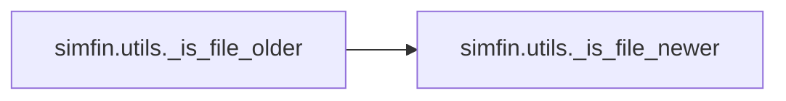

# Simfin Utils

[_Documentation generated by Documatic_](https://www.documatic.com)

<!---Documatic-section-Codebase Structure-start--->
## Codebase Structure

<!---Documatic-block-system_architecture-start--->

<!---Documatic-block-system_architecture-end--->

# #
<!---Documatic-section-Codebase Structure-end--->

<!---Documatic-section-simfin.utils.apply-start--->
## [simfin.utils.apply](3-simfin_utils.md#simfin.utils.apply)

<!---Documatic-section-apply-start--->
<!---Documatic-block-simfin.utils.apply-start--->
<details>
	<summary><code>simfin.utils.apply</code> code snippet</summary>

```python
def apply(df, func, group_index=TICKER, **kwargs):
    assert isinstance(df, (pd.DataFrame, pd.Series))
    assert isinstance(df.index, (pd.DatetimeIndex, pd.MultiIndex))
    if isinstance(df.index, pd.DatetimeIndex):
        df_result = func(df, **kwargs)
    elif isinstance(df.index, pd.MultiIndex):

        def _apply_group(df_grp):
            df_grp = df_grp.reset_index(group_index, drop=True)
            df_grp_result = func(df_grp, **kwargs)
            return df_grp_result
        df_result = df.groupby(group_index).apply(_apply_group)
    return df_result
```
</details>
<!---Documatic-block-simfin.utils.apply-end--->
<!---Documatic-section-apply-end--->

# #
<!---Documatic-section-simfin.utils.apply-end--->

<!---Documatic-section-simfin.utils.rename_columns-start--->
## [simfin.utils.rename_columns](3-simfin_utils.md#simfin.utils.rename_columns)

<!---Documatic-section-rename_columns-start--->
<!---Documatic-block-simfin.utils.rename_columns-start--->
<details>
	<summary><code>simfin.utils.rename_columns</code> code snippet</summary>

```python
def rename_columns(df, new_names, inplace=False):
    if isinstance(df, pd.DataFrame):
        df = df.rename(columns=new_names, inplace=inplace)
    elif isinstance(df, pd.Series):
        assert isinstance(new_names, str)
        df = df.rename(new_names, inplace=inplace)
    return df
```
</details>
<!---Documatic-block-simfin.utils.rename_columns-end--->
<!---Documatic-section-rename_columns-end--->

# #
<!---Documatic-section-simfin.utils.rename_columns-end--->

<!---Documatic-section-simfin.utils._file_age-start--->
## [simfin.utils._file_age](3-simfin_utils.md#simfin.utils._file_age)

<!---Documatic-section-_file_age-start--->
<!---Documatic-block-simfin.utils._file_age-start--->
<details>
	<summary><code>simfin.utils._file_age</code> code snippet</summary>

```python
def _file_age(path):
    file_timestamp = os.path.getmtime(path)
    time_dif = time.time() - file_timestamp
    time_dif = timedelta(seconds=int(round(time_dif)))
    return time_dif
```
</details>
<!---Documatic-block-simfin.utils._file_age-end--->
<!---Documatic-section-_file_age-end--->

# #
<!---Documatic-section-simfin.utils._file_age-end--->

<!---Documatic-section-simfin.utils.convert_to_periods-start--->
## [simfin.utils.convert_to_periods](3-simfin_utils.md#simfin.utils.convert_to_periods)

<!---Documatic-section-convert_to_periods-start--->
<!---Documatic-block-simfin.utils.convert_to_periods-start--->
<details>
	<summary><code>simfin.utils.convert_to_periods</code> code snippet</summary>

```python
def convert_to_periods(freq, bdays=0, days=0, weeks=0, months=0, quarters=0, years=0):
    total_years = bdays / BDAYS_PER_YEAR + days / DAYS_PER_YEAR + weeks / WEEKS_PER_YEAR + months / MONTHS_PER_YEAR + quarters / QUARTERS_PER_YEAR + years
    freq = freq.lower()
    if freq in ['bdays', 'b']:
        periods = round(BDAYS_PER_YEAR * total_years)
        shifted_years = periods / BDAYS_PER_YEAR
    elif freq in ['days', 'd']:
        periods = round(DAYS_PER_YEAR * total_years)
        shifted_years = periods / DAYS_PER_YEAR
    elif freq in ['weeks', 'w']:
        periods = round(WEEKS_PER_YEAR * total_years)
        shifted_years = periods / WEEKS_PER_YEAR
    elif freq in ['months', 'm']:
        periods = round(MONTHS_PER_YEAR * total_years)
        shifted_years = periods / MONTHS_PER_YEAR
    elif freq in ['quarters', 'q', 'ttm']:
        periods = round(QUARTERS_PER_YEAR * total_years)
        shifted_years = periods / QUARTERS_PER_YEAR
    elif freq in ['years', 'y', 'annual', 'a']:
        periods = round(total_years)
        shifted_years = periods
    else:
        msg = "Unsupported arg freq='{}'".format(freq)
        raise ValueError(msg)
    periods = int(periods)
    return (periods, shifted_years)
```
</details>
<!---Documatic-block-simfin.utils.convert_to_periods-end--->
<!---Documatic-section-convert_to_periods-end--->

# #
<!---Documatic-section-simfin.utils.convert_to_periods-end--->

<!---Documatic-section-simfin.utils.add_date_offset-start--->
## [simfin.utils.add_date_offset](3-simfin_utils.md#simfin.utils.add_date_offset)

<!---Documatic-section-add_date_offset-start--->
<!---Documatic-block-simfin.utils.add_date_offset-start--->
<details>
	<summary><code>simfin.utils.add_date_offset</code> code snippet</summary>

```python
def add_date_offset(df, date_index=REPORT_DATE, offset=pd.DateOffset(days=90)):
    df2 = df.reset_index(date_index)
    df2[date_index] += offset
    df2 = df2.set_index(date_index, append=True)
    return df2
```
</details>
<!---Documatic-block-simfin.utils.add_date_offset-end--->
<!---Documatic-section-add_date_offset-end--->

# #
<!---Documatic-section-simfin.utils.add_date_offset-end--->

<!---Documatic-section-simfin.utils._is_str_or_list_str-start--->
## [simfin.utils._is_str_or_list_str](3-simfin_utils.md#simfin.utils._is_str_or_list_str)

<!---Documatic-section-_is_str_or_list_str-start--->
<!---Documatic-block-simfin.utils._is_str_or_list_str-start--->
<details>
	<summary><code>simfin.utils._is_str_or_list_str</code> code snippet</summary>

```python
def _is_str_or_list_str(s):
    return isinstance(s, str) or (isinstance(s, list) and all((isinstance(x, str) for x in s)))
```
</details>
<!---Documatic-block-simfin.utils._is_str_or_list_str-end--->
<!---Documatic-section-_is_str_or_list_str-end--->

# #
<!---Documatic-section-simfin.utils._is_str_or_list_str-end--->

<!---Documatic-section-simfin.utils._is_file_older-start--->
## [simfin.utils._is_file_older](3-simfin_utils.md#simfin.utils._is_file_older)

<!---Documatic-section-_is_file_older-start--->


### Object Calls

* simfin.utils._is_file_newer

<!---Documatic-block-simfin.utils._is_file_older-start--->
<details>
	<summary><code>simfin.utils._is_file_older</code> code snippet</summary>

```python
def _is_file_older(**kwargs):
    return not _is_file_newer(**kwargs)
```
</details>
<!---Documatic-block-simfin.utils._is_file_older-end--->
<!---Documatic-section-_is_file_older-end--->

# #
<!---Documatic-section-simfin.utils._is_file_older-end--->

[_Documentation generated by Documatic_](https://www.documatic.com)