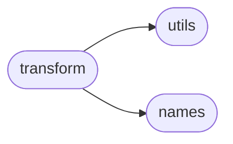
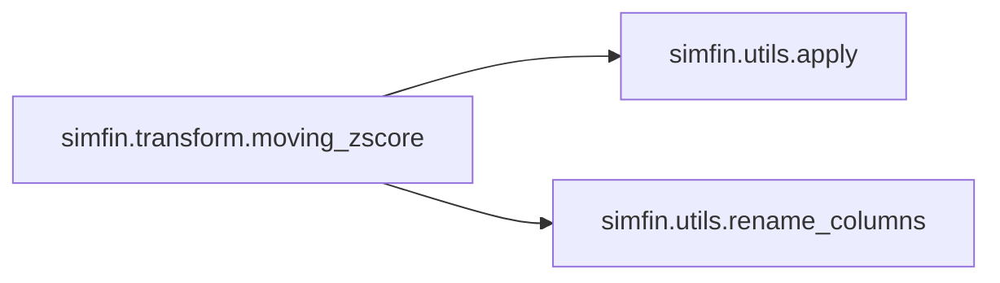
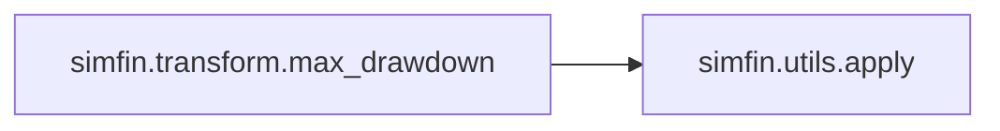

# Simfin Transform

[_Documentation generated by Documatic_](https://www.documatic.com)

<!---Documatic-section-Codebase Structure-start--->
## Codebase Structure

<!---Documatic-block-system_architecture-start--->

<!---Documatic-block-system_architecture-end--->

# #
<!---Documatic-section-Codebase Structure-end--->

<!---Documatic-section-simfin.transform.rel_change_ttm_1y-start--->
## [simfin.transform.rel_change_ttm_1y](4-simfin_transform.md#simfin.transform.rel_change_ttm_1y)

<!---Documatic-section-rel_change_ttm_1y-start--->
<!---Documatic-block-simfin.transform.rel_change_ttm_1y-start--->
<details>
	<summary><code>simfin.transform.rel_change_ttm_1y</code> code snippet</summary>

```python
def rel_change_ttm_1y(df):
    return df / df.shift(4) - 1
```
</details>
<!---Documatic-block-simfin.transform.rel_change_ttm_1y-end--->
<!---Documatic-section-rel_change_ttm_1y-end--->

# #
<!---Documatic-section-simfin.transform.rel_change_ttm_1y-end--->

<!---Documatic-section-simfin.transform.clip-start--->
## [simfin.transform.clip](4-simfin_transform.md#simfin.transform.clip)

<!---Documatic-section-clip-start--->
<!---Documatic-block-simfin.transform.clip-start--->
<details>
	<summary><code>simfin.transform.clip</code> code snippet</summary>

```python
def clip(df, lower, upper, clip=True):
    if isinstance(lower, dict):
        lower = pd.Series(lower)
    if isinstance(upper, dict):
        upper = pd.Series(upper)
    if clip:
        df_clipped = df.clip(lower=lower, upper=upper, axis='columns')
        df_clipped = df_clipped.fillna(df)
    else:
        mask_outside = (df < lower) | (df > upper)
        df_clipped = df.where(~mask_outside)
    return df_clipped
```
</details>
<!---Documatic-block-simfin.transform.clip-end--->
<!---Documatic-section-clip-end--->

# #
<!---Documatic-section-simfin.transform.clip-end--->

<!---Documatic-section-simfin.transform.moving_zscore-start--->
## [simfin.transform.moving_zscore](4-simfin_transform.md#simfin.transform.moving_zscore)

<!---Documatic-section-moving_zscore-start--->


### Object Calls

* [simfin.utils.apply](3-simfin_utils.md#simfin.utils.apply)
* [simfin.utils.rename_columns](3-simfin_utils.md#simfin.utils.rename_columns)

<!---Documatic-block-simfin.transform.moving_zscore-start--->
<details>
	<summary><code>simfin.transform.moving_zscore</code> code snippet</summary>

```python
def moving_zscore(df, periods, rolling=True, new_names=None, group_index=TICKER):
    if rolling:

        def _moving_zscore(df):
            x = df.rolling(window=periods)
            return (df - x.mean()) / x.std()
    else:

        def _moving_zscore(df):
            x = df.expanding(min_periods=periods)
            return (df - x.mean()) / x.std()
    df_result = apply(df=df, func=_moving_zscore, group_index=group_index)
    if new_names is not None:
        rename_columns(df=df_result, new_names=new_names, inplace=True)
    return df_result
```
</details>
<!---Documatic-block-simfin.transform.moving_zscore-end--->
<!---Documatic-section-moving_zscore-end--->

# #
<!---Documatic-section-simfin.transform.moving_zscore-end--->

<!---Documatic-section-simfin.transform.avg_ttm-start--->
## [simfin.transform.avg_ttm](4-simfin_transform.md#simfin.transform.avg_ttm)

<!---Documatic-section-avg_ttm-start--->
<!---Documatic-block-simfin.transform.avg_ttm-start--->
<details>
	<summary><code>simfin.transform.avg_ttm</code> code snippet</summary>

```python
def avg_ttm(df, years):
    df_result = df.copy()
    for i in range(1, years):
        df_result += df.shift(4 * i)
    df_result /= years
    return df_result
```
</details>
<!---Documatic-block-simfin.transform.avg_ttm-end--->
<!---Documatic-section-avg_ttm-end--->

# #
<!---Documatic-section-simfin.transform.avg_ttm-end--->

<!---Documatic-section-simfin.transform.max_drawdown-start--->
## [simfin.transform.max_drawdown](4-simfin_transform.md#simfin.transform.max_drawdown)

<!---Documatic-section-max_drawdown-start--->


### Object Calls

* [simfin.utils.apply](3-simfin_utils.md#simfin.utils.apply)

<!---Documatic-block-simfin.transform.max_drawdown-start--->
<details>
	<summary><code>simfin.transform.max_drawdown</code> code snippet</summary>

```python
def max_drawdown(df, window=None, group_index=TICKER):
    if window is None:

        def _max_drawdown(df):
            return df / df.cummax() - 1.0
    else:

        def _max_drawdown(df):
            return df / df.rolling(window=window).max() - 1.0
    df_result = apply(df=df, func=_max_drawdown, group_index=group_index)
    return df_result
```
</details>
<!---Documatic-block-simfin.transform.max_drawdown-end--->
<!---Documatic-section-max_drawdown-end--->

# #
<!---Documatic-section-simfin.transform.max_drawdown-end--->

<!---Documatic-section-simfin.transform.avg_ttm_3y-start--->
## [simfin.transform.avg_ttm_3y](4-simfin_transform.md#simfin.transform.avg_ttm_3y)

<!---Documatic-section-avg_ttm_3y-start--->
<!---Documatic-block-simfin.transform.avg_ttm_3y-start--->
<details>
	<summary><code>simfin.transform.avg_ttm_3y</code> code snippet</summary>

```python
def avg_ttm_3y(df):
    return 1.0 / 3.0 * (df + df.shift(4) + df.shift(8))
```
</details>
<!---Documatic-block-simfin.transform.avg_ttm_3y-end--->
<!---Documatic-section-avg_ttm_3y-end--->

# #
<!---Documatic-section-simfin.transform.avg_ttm_3y-end--->

<!---Documatic-section-simfin.transform.rel_change_ttm_2y-start--->
## [simfin.transform.rel_change_ttm_2y](4-simfin_transform.md#simfin.transform.rel_change_ttm_2y)

<!---Documatic-section-rel_change_ttm_2y-start--->
<!---Documatic-block-simfin.transform.rel_change_ttm_2y-start--->
<details>
	<summary><code>simfin.transform.rel_change_ttm_2y</code> code snippet</summary>

```python
def rel_change_ttm_2y(df):
    return df / df.shift(8) - 1
```
</details>
<!---Documatic-block-simfin.transform.rel_change_ttm_2y-end--->
<!---Documatic-section-rel_change_ttm_2y-end--->

# #
<!---Documatic-section-simfin.transform.rel_change_ttm_2y-end--->

<!---Documatic-section-simfin.transform.winsorize-start--->
## [simfin.transform.winsorize](4-simfin_transform.md#simfin.transform.winsorize)

<!---Documatic-section-winsorize-start--->


### Object Calls

* [simfin.transform.clip](4-simfin_transform.md#simfin.transform.clip)

<!---Documatic-block-simfin.transform.winsorize-start--->
<details>
	<summary><code>simfin.transform.winsorize</code> code snippet</summary>

```python
def winsorize(df, quantile=0.05, clip=True, columns=None, exclude_columns=None):
    if columns is not None and exclude_columns is not None:
        msg = 'Arguments columns and exclude_columns cannot both be set'
        raise ValueError(msg)
    if exclude_columns is not None:
        columns = df.columns.difference(exclude_columns)
    if columns is not None:
        df_result = df.copy()
        df_result[columns] = winsorize(df=df[columns], quantile=quantile, clip=clip)
    else:
        mask = np.isfinite(df)
        lower = df[mask].quantile(q=quantile)
        upper = df[mask].quantile(q=1.0 - quantile)
        if clip:
            axis = 'columns' if isinstance(df, pd.DataFrame) else None
            df_result = df.clip(lower=lower, upper=upper, axis=axis)
        else:
            mask_outside = (df < lower) | (df > upper)
            df_result = df.copy()
            df_result[mask_outside] = np.nan
    return df_result
```
</details>
<!---Documatic-block-simfin.transform.winsorize-end--->
<!---Documatic-section-winsorize-end--->

# #
<!---Documatic-section-simfin.transform.winsorize-end--->

<!---Documatic-section-simfin.transform.avg_ttm_2y-start--->
## [simfin.transform.avg_ttm_2y](4-simfin_transform.md#simfin.transform.avg_ttm_2y)

<!---Documatic-section-avg_ttm_2y-start--->
<!---Documatic-block-simfin.transform.avg_ttm_2y-start--->
<details>
	<summary><code>simfin.transform.avg_ttm_2y</code> code snippet</summary>

```python
def avg_ttm_2y(df):
    return 0.5 * (df + df.shift(4))
```
</details>
<!---Documatic-block-simfin.transform.avg_ttm_2y-end--->
<!---Documatic-section-avg_ttm_2y-end--->

# #
<!---Documatic-section-simfin.transform.avg_ttm_2y-end--->

[_Documentation generated by Documatic_](https://www.documatic.com)