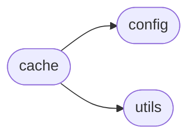
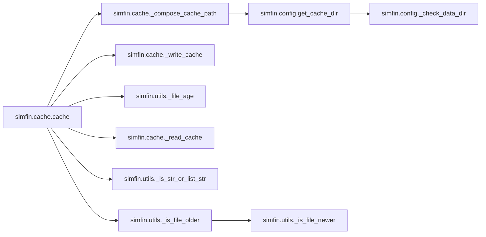

# Simfin Cache

[_Documentation generated by Documatic_](https://www.documatic.com)

<!---Documatic-section-Codebase Structure-start--->
## Codebase Structure

<!---Documatic-block-system_architecture-start--->

<!---Documatic-block-system_architecture-end--->

# #
<!---Documatic-section-Codebase Structure-end--->

<!---Documatic-section-simfin.cache.cache-start--->
## [simfin.cache.cache](5-simfin_cache.md#simfin.cache.cache)

<!---Documatic-section-cache-start--->


### Object Calls

* [simfin.cache._compose_cache_path](5-simfin_cache.md#simfin.cache._compose_cache_path)
* [simfin.cache._write_cache](5-simfin_cache.md#simfin.cache._write_cache)
* [simfin.utils._file_age](3-simfin_utils.md#simfin.utils._file_age)
* [simfin.cache._read_cache](5-simfin_cache.md#simfin.cache._read_cache)
* [simfin.utils._is_str_or_list_str](3-simfin_utils.md#simfin.utils._is_str_or_list_str)
* [simfin.utils._is_file_older](3-simfin_utils.md#simfin.utils._is_file_older)

<!---Documatic-block-simfin.cache.cache-start--->
<details>
	<summary><code>simfin.cache.cache</code> code snippet</summary>

```python
def cache(func):

    @wraps(func)
    def wrapper(cache_name=None, cache_refresh=None, cache_format='pickle', **kwargs):
        """
        This uses more advanced Python features to wrap `func` using a
        function-decorator, which are not explained so well in the
        official Python documentation.

        A good video tutorial explaining how this works is found here:
        https://www.youtube.com/watch?v=KlBPCzcQNU8

        Because we are using @wraps the original function name and doc-string
        is kept in the wrapped / decorated function. So you may want to copy
        the following doc-strings for the parameters into the doc-string of the
        function you have wrapped with `@cache`.

        :param cache_name:
            String with the name of the cache-file. The full filename is the
            function's name + '-' + `cache_name` + '.' + `cache_format`

        :param cache_refresh:
            Determines if `func` should be called and the results saved to the
            cache-file. Different conditions are supported, depending on the
            type and value of this argument:

            - If `None` then the cache-file is never used and `func` is always
              called as normal.
            - If `True` then `func` is called and the cache-file refreshed.
            - If `False` the cache-file is always used, unless it does not
              exist, in which case `func` is called and the cache-file saved.
            - If an integer which is lower than the cache-file's age in days,
              then `func` is called and the cache-file is refreshed. The cache
              is also refreshed if the integer is 0 (zero).
            - If a string or list of strings, these are considered file-paths
              e.g. for dataset-files. If the cache-file is older than any one
              of those files, then `func` is called and the cache-file is
              refreshed.

        :param cache_format:
            String with the format of the cache-file. Default is 'pickle' which
            is very fast but creates large, uncompressed files. Compression can
            be enabled with the option 'pickle.gz' which is slightly slower.

            Other valid options are: 'parquet' and 'feather' which put several
            restrictions on the DataFrames, and are mainly useful for sharing
            the DataFrames with others. Note that you need to manually install
            the `pyarrow` package if you want to use these options.

        :param kwargs:
            Additional keyword arguments to pass to the wrapped function.

        :return:
            Pandas DataFrame with either the contents of the cache-file,
            or the results from computing the wrapped function.
        """
        if cache_refresh is None:
            df_result = func(**kwargs)
        else:
            assert cache_format.startswith('pickle') or cache_format in ['parquet', 'feather']
            (cache_filename, cache_path) = _compose_cache_path(func=func, cache_name=cache_name, cache_format=cache_format)
            if os.path.exists(cache_path):
                cache_file_age_days = _file_age(cache_path).days
                msg = "Cache-file '{0}' on disk ({1} days old)."
                msg = msg.format(cache_filename, cache_file_age_days)
                print(msg)
                if isinstance(cache_refresh, bool):
                    compute = cache_refresh
                elif isinstance(cache_refresh, int):
                    compute = cache_refresh == 0 or cache_file_age_days > cache_refresh
                elif _is_str_or_list_str(cache_refresh):
                    compute = _is_file_older(path=cache_path, other_paths=cache_refresh)
                else:
                    msg = 'invalid arg cache_refresh={0}'
                    msg = msg.format(cache_refresh)
                    raise ValueError(msg)
                if not compute:
                    print('- Loading from disk ... ', end='')
                    df_result = _read_cache(path=cache_path, cache_format=cache_format)
                    print('Done!')
            else:
                compute = True
                msg = "Cache-file '{0}' not on disk."
                msg = msg.format(cache_filename)
                print(msg)
            if compute:
                msg = '- Running function {0}() ... '
                msg = msg.format(func.__name__)
                print(msg, end='')
                df_result = func(**kwargs)
                print('Done!')
                print('- Saving cache-file to disk ... ', end='')
                _write_cache(df=df_result, path=cache_path, cache_format=cache_format)
                print('Done!')
        return df_result
    return wrapper
```
</details>
<!---Documatic-block-simfin.cache.cache-end--->
<!---Documatic-section-cache-end--->

# #
<!---Documatic-section-simfin.cache.cache-end--->

<!---Documatic-section-simfin.cache._write_cache-start--->
## [simfin.cache._write_cache](5-simfin_cache.md#simfin.cache._write_cache)

<!---Documatic-section-_write_cache-start--->
<!---Documatic-block-simfin.cache._write_cache-start--->
<details>
	<summary><code>simfin.cache._write_cache</code> code snippet</summary>

```python
def _write_cache(df, path, cache_format):
    if cache_format.startswith('pickle'):
        df.to_pickle(path)
    elif cache_format == 'parquet':
        df.to_parquet(path)
    elif cache_format == 'feather':
        df.to_feather(path)
```
</details>
<!---Documatic-block-simfin.cache._write_cache-end--->
<!---Documatic-section-_write_cache-end--->

# #
<!---Documatic-section-simfin.cache._write_cache-end--->

<!---Documatic-section-simfin.cache._compose_cache_path-start--->
## [simfin.cache._compose_cache_path](5-simfin_cache.md#simfin.cache._compose_cache_path)

<!---Documatic-section-_compose_cache_path-start--->


### Object Calls

* simfin.config.get_cache_dir

<!---Documatic-block-simfin.cache._compose_cache_path-start--->
<details>
	<summary><code>simfin.cache._compose_cache_path</code> code snippet</summary>

```python
def _compose_cache_path(func, cache_name, cache_format):
    filename = func.__name__
    if cache_name is not None:
        filename += '-' + cache_name
    filename += '.' + cache_format
    path = os.path.join(get_cache_dir(), filename)
    return (filename, path)
```
</details>
<!---Documatic-block-simfin.cache._compose_cache_path-end--->
<!---Documatic-section-_compose_cache_path-end--->

# #
<!---Documatic-section-simfin.cache._compose_cache_path-end--->

<!---Documatic-section-simfin.cache._read_cache-start--->
## [simfin.cache._read_cache](5-simfin_cache.md#simfin.cache._read_cache)

<!---Documatic-section-_read_cache-start--->
<!---Documatic-block-simfin.cache._read_cache-start--->
<details>
	<summary><code>simfin.cache._read_cache</code> code snippet</summary>

```python
def _read_cache(path, cache_format):
    if cache_format.startswith('pickle'):
        df_result = pd.read_pickle(path)
    elif cache_format == 'parquet':
        df_result = pd.read_parquet(path)
    elif cache_format == 'feather':
        df_result = pd.read_feather(path)
    return df_result
```
</details>
<!---Documatic-block-simfin.cache._read_cache-end--->
<!---Documatic-section-_read_cache-end--->

# #
<!---Documatic-section-simfin.cache._read_cache-end--->

[_Documentation generated by Documatic_](https://www.documatic.com)