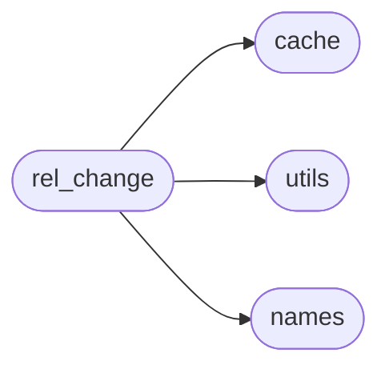
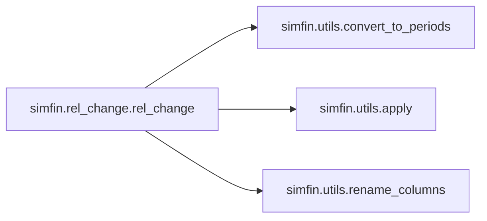
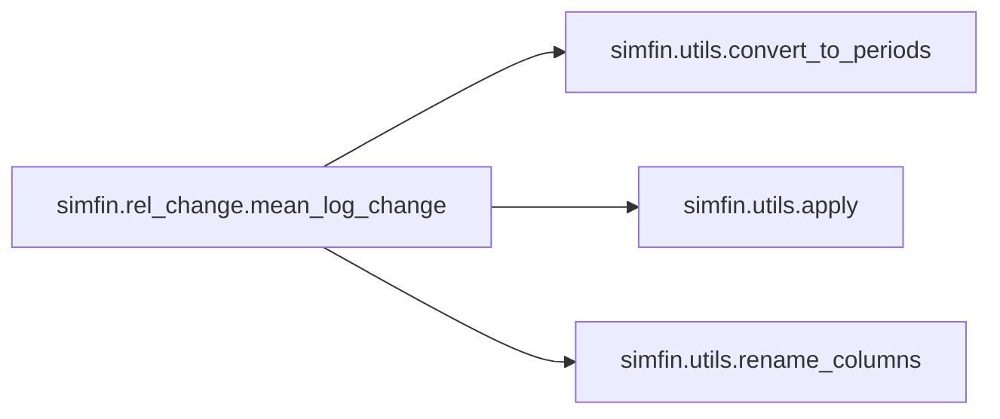

# Simfin Rel Change

[_Documentation generated by Documatic_](https://www.documatic.com)

<!---Documatic-section-Codebase Structure-start--->
## Codebase Structure

<!---Documatic-block-system_architecture-start--->

<!---Documatic-block-system_architecture-end--->

# #
<!---Documatic-section-Codebase Structure-end--->

<!---Documatic-section-simfin.rel_change.rel_change-start--->
## simfin.rel_change.rel_change

<!---Documatic-section-rel_change-start--->


### Object Calls

* [simfin.utils.convert_to_periods](3-simfin_utils.md#simfin.utils.convert_to_periods)
* [simfin.utils.apply](3-simfin_utils.md#simfin.utils.apply)
* [simfin.utils.rename_columns](3-simfin_utils.md#simfin.utils.rename_columns)

<!---Documatic-block-simfin.rel_change.rel_change-start--->
<details>
	<summary><code>simfin.rel_change.rel_change</code> code snippet</summary>

```python
@cache
def rel_change(df, freq, future, bdays=0, days=0, weeks=0, months=0, quarters=0, years=0, annualized=False, new_names=None, group_index=TICKER):
    (periods, shifted_years) = convert_to_periods(freq=freq, bdays=bdays, days=days, weeks=weeks, months=months, quarters=quarters, years=years)

    def _rel_change(df_grp):
        df_grp_result = df_grp / df_grp.shift(periods=periods)
        if future:
            df_grp_result = df_grp_result.shift(periods=-periods)
        return df_grp_result
    df_result = apply(df=df, func=_rel_change, group_index=group_index)
    if annualized:
        df_result = df_result ** (1.0 / shifted_years) - 1.0
    else:
        df_result = df_result - 1.0
    if new_names is not None:
        rename_columns(df=df_result, new_names=new_names, inplace=True)
    return df_result
```
</details>
<!---Documatic-block-simfin.rel_change.rel_change-end--->
<!---Documatic-section-rel_change-end--->

# #
<!---Documatic-section-simfin.rel_change.rel_change-end--->

<!---Documatic-section-simfin.rel_change.mean_log_change-start--->
## simfin.rel_change.mean_log_change

<!---Documatic-section-mean_log_change-start--->


### Object Calls

* [simfin.utils.convert_to_periods](3-simfin_utils.md#simfin.utils.convert_to_periods)
* [simfin.utils.apply](3-simfin_utils.md#simfin.utils.apply)
* [simfin.utils.rename_columns](3-simfin_utils.md#simfin.utils.rename_columns)

<!---Documatic-block-simfin.rel_change.mean_log_change-start--->
<details>
	<summary><code>simfin.rel_change.mean_log_change</code> code snippet</summary>

```python
@cache
def mean_log_change(df, freq, future, min_bdays=0, min_days=0, min_weeks=0, min_months=0, min_quarters=0, min_years=0, max_bdays=0, max_days=0, max_weeks=0, max_months=0, max_quarters=0, max_years=0, annualized=False, new_names=None, group_index=TICKER):
    (min_periods, min_shifted_years) = convert_to_periods(freq=freq, bdays=min_bdays, days=min_days, weeks=min_weeks, months=min_months, quarters=min_quarters, years=min_years)
    (max_periods, max_shifted_years) = convert_to_periods(freq=freq, bdays=max_bdays, days=max_days, weeks=max_weeks, months=max_months, quarters=max_quarters, years=max_years)
    assert min_periods < max_periods
    num_periods = max_periods - min_periods
    if annualized:
        x = np.arange(num_periods) / (num_periods - 1)
        shifted_years = (max_shifted_years - min_shifted_years) * x + min_shifted_years
        exponent = 1.0 / shifted_years
    else:
        exponent = 1.0 / np.arange(min_periods, max_periods)
    if not future:
        exponent = np.flip(exponent)
    exponent_sum = np.sum(exponent)
    df_log = np.log(df)

    def _dot_product(x):
        return np.sum(x * exponent)

    def _mean_log_change(df_log_grp):
        df_windowed = df_log_grp.rolling(num_periods).apply(_dot_product, raw=True)
        if future:
            df_windowed = df_windowed.shift(periods=-max_periods)
            df_mean_log_chg = (df_windowed - df_log_grp * exponent_sum) / num_periods
        else:
            df_windowed = df_windowed.shift(periods=min_periods)
            df_mean_log_chg = (df_log_grp * exponent_sum - df_windowed) / num_periods
        return df_mean_log_chg
    df_result = apply(df=df_log, func=_mean_log_change, group_index=group_index)
    if new_names is not None:
        rename_columns(df=df_result, new_names=new_names, inplace=True)
    return df_result
```
</details>
<!---Documatic-block-simfin.rel_change.mean_log_change-end--->
<!---Documatic-section-mean_log_change-end--->

# #
<!---Documatic-section-simfin.rel_change.mean_log_change-end--->

[_Documentation generated by Documatic_](https://www.documatic.com)