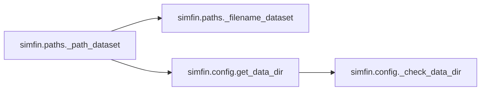
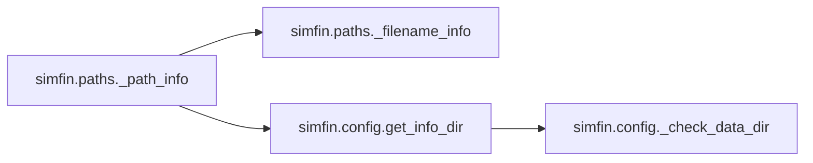

# Simfin Paths

[_Documentation generated by Documatic_](https://www.documatic.com)

<!---Documatic-section-Codebase Structure-start--->
## Codebase Structure

<!---Documatic-block-system_architecture-start--->

<!---Documatic-block-system_architecture-end--->

# #
<!---Documatic-section-Codebase Structure-end--->

<!---Documatic-section-simfin.paths._path_dataset-start--->
## [simfin.paths._path_dataset](7-simfin_paths.md#simfin.paths._path_dataset)

<!---Documatic-section-_path_dataset-start--->


### Object Calls

* [simfin.paths._filename_dataset](7-simfin_paths.md#simfin.paths._filename_dataset)
* [simfin.config.get_data_dir](15-simfin_config.md#simfin.config.get_data_dir)

<!---Documatic-block-simfin.paths._path_dataset-start--->
<details>
	<summary><code>simfin.paths._path_dataset</code> code snippet</summary>

```python
def _path_dataset(**kwargs):
    filename = _filename_dataset(extension='csv', **kwargs)
    path = os.path.join(get_data_dir(), filename)
    return path
```
</details>
<!---Documatic-block-simfin.paths._path_dataset-end--->
<!---Documatic-section-_path_dataset-end--->

# #
<!---Documatic-section-simfin.paths._path_dataset-end--->

<!---Documatic-section-simfin.paths._path_info-start--->
## [simfin.paths._path_info](7-simfin_paths.md#simfin.paths._path_info)

<!---Documatic-section-_path_info-start--->


### Object Calls

* [simfin.paths._filename_info](7-simfin_paths.md#simfin.paths._filename_info)
* [simfin.config.get_info_dir](15-simfin_config.md#simfin.config.get_info_dir)

<!---Documatic-block-simfin.paths._path_info-start--->
<details>
	<summary><code>simfin.paths._path_info</code> code snippet</summary>

```python
def _path_info(name):
    filename = _filename_info(name=name)
    path = os.path.join(get_info_dir(), filename)
    return path
```
</details>
<!---Documatic-block-simfin.paths._path_info-end--->
<!---Documatic-section-_path_info-end--->

# #
<!---Documatic-section-simfin.paths._path_info-end--->

<!---Documatic-section-simfin.paths._filename_info-start--->
## [simfin.paths._filename_info](7-simfin_paths.md#simfin.paths._filename_info)

<!---Documatic-section-_filename_info-start--->
<!---Documatic-block-simfin.paths._filename_info-start--->
<details>
	<summary><code>simfin.paths._filename_info</code> code snippet</summary>

```python
def _filename_info(name):
    return name + '.json'
```
</details>
<!---Documatic-block-simfin.paths._filename_info-end--->
<!---Documatic-section-_filename_info-end--->

# #
<!---Documatic-section-simfin.paths._filename_info-end--->

<!---Documatic-section-simfin.paths._filename_dataset-start--->
## [simfin.paths._filename_dataset](7-simfin_paths.md#simfin.paths._filename_dataset)

<!---Documatic-section-_filename_dataset-start--->
<!---Documatic-block-simfin.paths._filename_dataset-start--->
<details>
	<summary><code>simfin.paths._filename_dataset</code> code snippet</summary>

```python
def _filename_dataset(dataset, market=None, variant=None, extension=None):
    assert dataset is not None
    if market is None:
        filename = dataset
    else:
        filename = '{}-{}'.format(market, dataset)
    if variant is not None:
        filename = '{}-{}'.format(filename, variant)
    if extension is not None:
        filename = '{}.{}'.format(filename, extension)
    return filename
```
</details>
<!---Documatic-block-simfin.paths._filename_dataset-end--->
<!---Documatic-section-_filename_dataset-end--->

# #
<!---Documatic-section-simfin.paths._filename_dataset-end--->

[_Documentation generated by Documatic_](https://www.documatic.com)