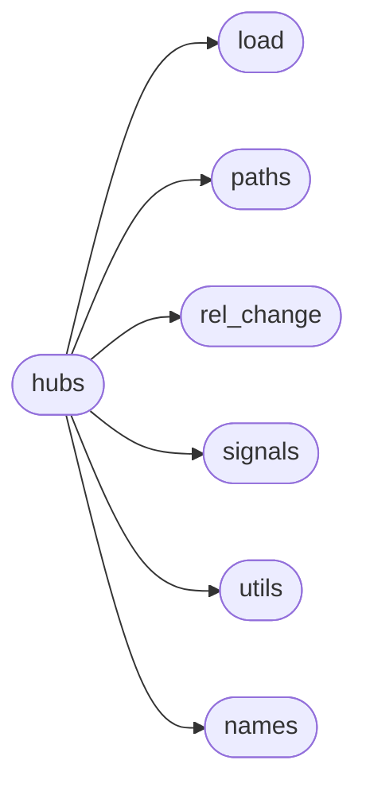

# Simfin Hubs

[_Documentation generated by Documatic_](https://www.documatic.com)

<!---Documatic-section-Codebase Structure-start--->
## Codebase Structure

<!---Documatic-block-system_architecture-start--->

<!---Documatic-block-system_architecture-end--->

# #
<!---Documatic-section-Codebase Structure-end--->

<!---Documatic-section-simfin.hubs.StockHub-start--->
## [simfin.hubs.StockHub](8-simfin_hubs.md#simfin.hubs.StockHub)

<!---Documatic-section-StockHub-start--->
<!---Documatic-block-simfin.hubs.StockHub-start--->
<details>
	<summary><code>simfin.hubs.StockHub</code> code snippet</summary>

```python
class StockHub:

    def __init__(self, market='us', tickers=None, banks=False, insurance=False, refresh_days=30, refresh_days_shareprices=30, group_index=TICKER, date_index=REPORT_DATE, offset=None, fill_method='ffill', cache_format='pickle'):
        """
        :param market:
            String for the stock-market e.g. 'us' or 'de'.

        :param tickers:
            List of strings for the tickers you want to use. The full datasets
            are still downloaded/loaded, but only the data for these tickers
            will be used in the various functions of this class. Set to `None`
            if you want to use data for all tickers. If `group_index=SIMFIN_ID`
            then `tickers` must be a list of integers.

        :param banks:
            Boolean whether to use the special datasets for banks.

        :param insurance:
            Boolean whether to use the special datasets for insurance
            companies.

        :param refresh_days:
            Integer with the number of days before refreshing datasets by
            downloading them again from the SimFin server.

        :param refresh_days_shareprices:
            Integer with the number of days before the share-prices datasets
            are refreshed by downloading them again from the SimFin server.

        :param group_index:
            Group the rows in a DataFrame using this index-column. By default
            this is TICKER but it could also be e.g. SIMFIN_ID if you are using
            that as an index in your DataFrame.

        :param date_index:
            Name of the data-column which will be used as the date-index for
            the fundamental data. By default this is REPORT_DATE but it could
            also be PUBLISH_DATE or FISCAL_YEAR.

        :param offset:
            Pandas DateOffset added to the date-index of the Pandas DataFrames
            with the fundamental data. Example: `pd.DateOffset(days=60)` This
            is useful if you are using `date_index=REPORT_DATE` and want to
            add a lag of e.g. 60 days to the dates of financial reports with
            Income Statements, Balance Sheets, and Cash-Flow Statements,
            because the REPORT_DATE is not when it was actually made available
            to the public, which can be 1, 2 or even 3 months after the
            REPORT_DATE. See :obj:`~simfin.utils.add_date_offset` for more
            details on how to set this parameter.
            You can also use `date_index=PUBLISH_DATE` instead to get the first
            date that the financial report was published.

        :param fill_method:
            String or callable for the method of filling in empty values when
            reindexing financial data to daily data-points.
            See :obj:`~simfin.resample.reindex` for valid options.

        :param cache_format:
            String with the format of the cache-file. Default is 'pickle' which
            is very fast but creates large, uncompressed files. Compression can
            be enabled with the option 'pickle.gz' which is slightly slower.
            See :obj:`~simfin.cache.cache` for more options.
        """
        self._market = market
        self._tickers = tickers
        self._refresh_days = refresh_days
        self._refresh_days_shareprices = refresh_days_shareprices
        self._group_index = group_index
        self._cache_format = cache_format
        self._fill_method = fill_method
        self._fundamental_index = [group_index, date_index]
        if banks:
            self._dataset_extension = '-banks'
        elif insurance:
            self._dataset_extension = '-insurance'
        else:
            self._dataset_extension = ''
        if tickers is not None:
            all_tickers = '-'.join(map(str, tickers))
            ticker_hash = hashlib.sha1(all_tickers.encode('utf-8')).hexdigest()
        else:
            ticker_hash = None
        self._cache_ids = [market, group_index, date_index, offset, fill_method, self._dataset_extension, ticker_hash]
        self._signal_args = {'offset': offset, 'fill_method': fill_method, 'group_index': group_index, 'date_index': date_index}

    def _cache_args(self, datasets, cache_ids=[]):
        """
        Create and return a dict with the arguments for the `cache`
        wrapper-function.

        :param datasets:
            List of tuples with dataset names and variants. If any of these
            dataset-files is newer than the cache-file, then the cache must
            be refreshed.

        :param cache_ids:
            List of arguments such as strings, booleans, ints, etc. that
            can be used to uniquely identify a cache-file.

        :return:
            Dict with arguments for the `cache` wrapper-function.
        """
        dataset_paths = [_path_dataset(dataset=dataset + self._dataset_extension, variant=variant, market=self._market) for (dataset, variant) in datasets]
        all_cache_ids = self._cache_ids + cache_ids
        all_cache_ids_str = '-'.join(map(str, all_cache_ids))
        name_hash = hashlib.sha1(all_cache_ids_str.encode('utf-8')).hexdigest()
        name_hash = name_hash[:8]
        args = {'cache_name': name_hash, 'cache_refresh': dataset_paths, 'cache_format': self._cache_format}
        return args

    @lru_cache()
    def load_companies(self):
        """
        Load dataset with details about the companies in the chosen market.

        :return: Pandas DataFrame
        """
        df = load_companies(market=self._market, index=self._group_index, refresh_days=self._refresh_days)
        if self._tickers is not None:
            df = df.loc[self._tickers]
        return df

    @lru_cache()
    def load_shareprices(self, variant):
        """
        Load dataset with shareprices from the chosen market.

        :param variant: String for either the 'daily' or 'latest' shareprices.
        :return: Pandas DataFrame
        """
        df = load_shareprices(variant=variant, market=self._market, index=[self._group_index, DATE], refresh_days=self._refresh_days_shareprices)
        if self._tickers is not None:
            df = df.loc[self._tickers]
        return df

    @lru_cache()
    def load_derived_shareprices(self, variant):
        """
        Load dataset with share price ratios from the chosen market.

        :param variant: String for either the 'daily' or 'latest' ratios.
        :return: Pandas DataFrame
        """
        df = load_derived_shareprices(variant=variant, market=self._market, index=[self._group_index, DATE], refresh_days=self._refresh_days_shareprices)
        if self._tickers is not None:
            df = df.loc[self._tickers]
        return df

    @lru_cache()
    def load_fundamental(self, dataset, variant):
        """
        Load dataset with fundamental data for companies in the chosen market.

        :param dataset: Either 'income', 'balance' or 'cashflow'.
        :param variant: Either 'annual', 'quarterly' or 'ttm'.
        :return: Pandas DataFrame
        """
        dataset = dataset + self._dataset_extension
        df = load_fundamental(dataset=dataset, variant=variant, market=self._market, index=self._fundamental_index, refresh_days=self._refresh_days)
        if self._tickers is not None:
            df = df.loc[self._tickers]
        return df
    load_income = partialmethod(load_fundamental, dataset='income')
    load_balance = partialmethod(load_fundamental, dataset='balance')
    load_cashflow = partialmethod(load_fundamental, dataset='cashflow')
    load_derived = partialmethod(load_fundamental, dataset='derived')

    @lru_cache()
    def returns(self, name=None, future=True, annualized=False, bdays=0, days=0, weeks=0, months=0, quarters=0, years=0):
        """
        Calculate stock-returns for investment periods of the given duration.

        :param name:
            Use this as the name of the resulting Pandas Series. Otherwise it
            will be named TOTAL_RETURN.

        :param future:
            Boolean whether to calculate the future returns (True)
            or the past returns (False).

        :param annualized:
            Boolean whether to calculate the annualized returns (True)
            or the absolute returns (False). When calculating the returns over
            several years, it is often useful to calculate the annualized
            returns by setting this to True.

        :param bdays: Number of business or trading-days.
        :param days: Number of days in a 7-day week.
        :param weeks: Number of weeks.
        :param months: Number of months.
        :param quarters: Number of quarters.
        :param years: Number of years.

        :return:
            Pandas Series
        """
        df_prices = self.load_shareprices(variant='daily')
        datasets = [('shareprices', 'daily')]
        cache_ids = [name, future, annualized, bdays, days, weeks, months, quarters, years]
        cache_args = self._cache_args(datasets=datasets, cache_ids=cache_ids)
        df_tot_ret = df_prices[TOTAL_RETURN]
        df_result = rel_change(df=df_tot_ret, freq='bdays', future=future, annualized=annualized, bdays=bdays, days=days, weeks=weeks, months=months, quarters=quarters, years=years, new_names=name, group_index=self._group_index, **cache_args)
        return df_result

    @lru_cache()
    def mean_log_returns(self, name=None, future=True, annualized=False, min_bdays=0, min_days=0, min_weeks=0, min_months=0, min_quarters=0, min_years=0, max_bdays=0, max_days=0, max_weeks=0, max_months=0, max_quarters=0, max_years=0):
        """
        Calculate the mean-log stock-returns for all investment periods
        between the given min and max durations.

        :param name:
            Use this as the name of the resulting Pandas Series. Otherwise it
            will be named TOTAL_RETURN.

        :param future:
            Boolean whether to calculate the future returns (True)
            or the past returns (False).

        :param annualized:
            Boolean whether to calculate the annualized returns (True)
            or the absolute returns (False). When calculating the returns over
            several years, it is often useful to calculate the annualized
            returns by setting this to True.

        :param min_bdays: Min number of business or trading-days.
        :param min_days: Min number of days in a 7-day week.
        :param min_weeks: Min number of weeks.
        :param min_months: Min number of months.
        :param min_quarters: Min number of quarters.
        :param min_years: Min number of years.

        :param max_bdays: Max number of business or trading-days.
        :param max_days: Max number of days in a 7-day week.
        :param max_weeks: Max number of weeks.
        :param max_months: Max number of months.
        :param max_quarters: Max number of quarters.
        :param max_years: Max number of years.

        :return:
            Pandas Series
        """
        df_prices = self.load_shareprices(variant='daily')
        datasets = [('shareprices', 'daily')]
        cache_ids = [name, future, annualized, min_bdays, min_days, min_weeks, min_months, min_quarters, min_years, max_bdays, max_days, max_weeks, max_months, max_quarters, max_years]
        cache_args = self._cache_args(datasets=datasets, cache_ids=cache_ids)
        df_tot_ret = df_prices[TOTAL_RETURN]
        df_result = mean_log_change(df=df_tot_ret, freq='bdays', future=future, annualized=annualized, min_bdays=min_bdays, min_days=min_days, min_weeks=min_weeks, min_months=min_months, min_quarters=min_quarters, min_years=min_years, max_bdays=max_bdays, max_days=max_days, max_weeks=max_weeks, max_months=max_months, max_quarters=max_quarters, max_years=max_years, new_names=name, group_index=self._group_index, **cache_args)
        return df_result

    @lru_cache()
    def price_signals(self):
        """
        Calculate price-signals such as Moving Average and MACD for all stocks
        in the given DataFrame.

        :return:
            Pandas DataFrame
        """
        df_prices = self.load_shareprices(variant='daily')
        datasets = [('shareprices', 'daily')]
        cache_args = self._cache_args(datasets=datasets)
        df_result = price_signals(df_prices=df_prices, group_index=self._group_index, **cache_args)
        return df_result

    @lru_cache()
    def volume_signals(self, window=20, shares_index=SHARES_BASIC):
        """
        Calculate signals for the daily trading-volume of stocks.

        :param window:
            Integer for the number of days to use in moving-average
            calculations.

        :param shares_index:
            String with the column-name for the share-counts. SHARES_DILUTED
            takes the potential diluting impact of stock-options into account,
            while SHARES_BASIC does not take potential dilution into account.

        :return:
            Pandas DataFrame
        """
        df_prices = self.load_shareprices(variant='daily')
        df_income_ttm = self.load_income(variant='ttm')
        datasets = [('shareprices', 'daily'), ('income', 'ttm')]
        cache_ids = [window, shares_index]
        cache_args = self._cache_args(datasets=datasets, cache_ids=cache_ids)
        df_result = volume_signals(df_shares=df_income_ttm, df_prices=df_prices, window=window, shares_index=shares_index, **self._signal_args, **cache_args)
        return df_result

    @lru_cache()
    def growth_signals(self, variant='daily', func=None):
        """
        Calculate growth-signals such as Sales Growth, Earnings Growth, etc.
        for all stocks in the given DataFrames.

        :param variant:
            String with the frequency of the results. Valid options:

            - 'quarterly': The result has 4 data-points per year.
            - 'daily': The result has daily data-points, same as share-prices.
            - 'latest' The result is only for the latest share-price dates.

        :param func:
            Function to apply on a per-stock basis after the signals have been
            calculated, but before they have been reindexed to daily
            data-points. This is useful e.g. to calculate multi-year averages.
            This should be a real function (not a lambda-function) because its
            name will be used in the cache-filename.
            Example: `func=sf.avg_ttm_2y`

        :return:
            Pandas DataFrame
        """
        df_income_ttm = self.load_income(variant='ttm')
        df_income_qrt = self.load_income(variant='quarterly')
        df_balance_ttm = self.load_balance(variant='ttm')
        df_balance_qrt = self.load_balance(variant='quarterly')
        df_cashflow_ttm = self.load_cashflow(variant='ttm')
        df_cashflow_qrt = self.load_cashflow(variant='quarterly')
        datasets = [('income', 'ttm'), ('income', 'quarterly'), ('balance', 'ttm'), ('balance', 'quarterly'), ('cashflow', 'ttm'), ('cashflow', 'quarterly')]
        cache_ids = [variant, _func_name(func=func)]
        if variant in ['daily', 'latest']:
            df_prices = self.load_shareprices(variant=variant)
            datasets.append(('shareprices', variant))
        elif variant == 'quarterly':
            df_prices = None
        else:
            msg = 'invalid arg variant={0}'.format(variant)
            raise ValueError(msg)
        cache_args = self._cache_args(datasets=datasets, cache_ids=cache_ids)
        df_result = growth_signals(df_income_ttm=df_income_ttm, df_income_qrt=df_income_qrt, df_balance_ttm=df_balance_ttm, df_balance_qrt=df_balance_qrt, df_cashflow_ttm=df_cashflow_ttm, df_cashflow_qrt=df_cashflow_qrt, df_prices=df_prices, func=func, **self._signal_args, **cache_args)
        return df_result

    @lru_cache()
    def fin_signals(self, variant='daily', func=None):
        """
        Calculate financial signals such as Net Profit Margin, Debt Ratio, etc.

        :param variant:
            String with the frequency of the results. Valid options:

            - 'quarterly': The result has 4 data-points per year.
            - 'daily': The result has daily data-points, same as share-prices.
            - 'latest' The result is only for the latest share-price dates.

        :param func:
            Function to apply on a per-stock basis after the signals have been
            calculated, but before they have been reindexed to daily
            data-points. This is useful e.g. to calculate multi-year averages.
            This should be a real function (not a lambda-function) because its
            name will be used in the cache-filename.
            Example: `func=sf.avg_ttm_2y` to calculate 2-year averages.
            Example: `func=sf.rel_change_ttm_1y` to calculate 1-year change.

        :return:
            Pandas DataFrame
        """
        df_income_ttm = self.load_income(variant='ttm')
        df_balance_ttm = self.load_balance(variant='ttm')
        df_cashflow_ttm = self.load_cashflow(variant='ttm')
        datasets = [('income', 'ttm'), ('balance', 'ttm'), ('cashflow', 'ttm')]
        if variant in ['daily', 'latest']:
            df_prices = self.load_shareprices(variant=variant)
            datasets.append(('shareprices', variant))
        elif variant == 'quarterly':
            df_prices = None
        else:
            msg = 'invalid arg variant={0}'.format(variant)
            raise ValueError(msg)
        cache_ids = [variant, _func_name(func=func)]
        cache_args = self._cache_args(datasets=datasets, cache_ids=cache_ids)
        banks = False
        insurance = False
        if self._dataset_extension == '-banks':
            banks = True
        elif self._dataset_extension == '-insurance':
            insurance = True
        df_result = fin_signals(df_income_ttm=df_income_ttm, df_balance_ttm=df_balance_ttm, df_cashflow_ttm=df_cashflow_ttm, df_prices=df_prices, func=func, banks=banks, insurance=insurance, **self._signal_args, **cache_args)
        return df_result

    @lru_cache()
    def val_signals(self, variant='daily', func=None, shares_index=SHARES_DILUTED):
        """
        Calculate valuation signals such as P/E and P/Sales ratios.

        :param variant:
            String with the frequency of the results. Valid options:

            - 'daily': The result has daily data-points, same as share-prices.
            - 'latest' The result is only for the latest share-price dates.

        :param func:
            Function to apply on a per-stock basis on the financial data,
            before calculating the valuation signals. This is useful e.g. to
            calculate multi-year averages of the Net Income and Revenue and
            use those when calculating P/E and P/Sales ratios. This should
            be a real function (not a lambda-function) because its name will
            be used in the cache-filename. Example: `func=sf.avg_ttm_2y`

        :param shares_index:
            String with the column-name for the share-counts. SHARES_DILUTED
            takes the potential diluting impact of stock-options into account,
            so it results in more conservative valuation ratios than
            SHARES_BASIC.

        :return:
            Pandas DataFrame
        """
        df_prices = self.load_shareprices(variant=variant)
        df_income_ttm = self.load_income(variant='ttm')
        df_balance_ttm = self.load_balance(variant='ttm')
        df_cashflow_ttm = self.load_cashflow(variant='ttm')
        datasets = [('shareprices', variant), ('income', 'ttm'), ('balance', 'ttm'), ('cashflow', 'ttm')]
        cache_ids = [variant, _func_name(func=func), shares_index]
        cache_args = self._cache_args(datasets=datasets, cache_ids=cache_ids)
        banks = False
        insurance = False
        if self._dataset_extension == '-banks':
            banks = True
        elif self._dataset_extension == '-insurance':
            insurance = True
        df_result = val_signals(df_prices=df_prices, df_income_ttm=df_income_ttm, df_balance_ttm=df_balance_ttm, df_cashflow_ttm=df_cashflow_ttm, shares_index=shares_index, func=func, banks=banks, insurance=insurance, **self._signal_args, **cache_args)
        return df_result
```
</details>
<!---Documatic-block-simfin.hubs.StockHub-end--->
<!---Documatic-section-StockHub-end--->

# #
<!---Documatic-section-simfin.hubs.StockHub-end--->

[_Documentation generated by Documatic_](https://www.documatic.com)