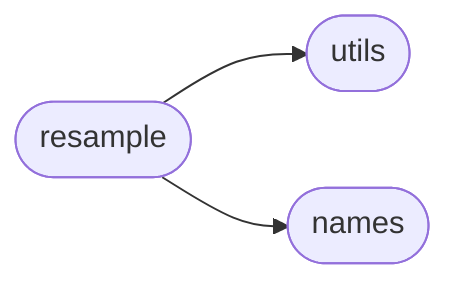
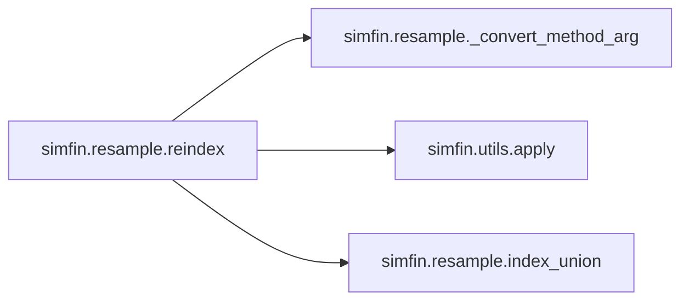
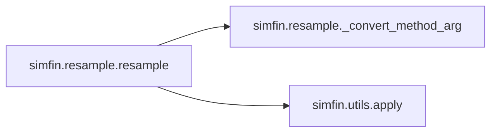
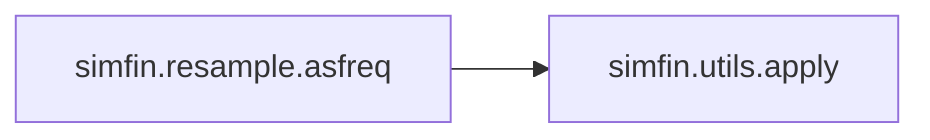

# Simfin Resample

[_Documentation generated by Documatic_](https://www.documatic.com)

<!---Documatic-section-Codebase Structure-start--->
## Codebase Structure

<!---Documatic-block-system_architecture-start--->

<!---Documatic-block-system_architecture-end--->

# #
<!---Documatic-section-Codebase Structure-end--->

<!---Documatic-section-simfin.resample.reindex-start--->
## [simfin.resample.reindex](9-simfin_resample.md#simfin.resample.reindex)

<!---Documatic-section-reindex-start--->


### Object Calls

* [simfin.resample._convert_method_arg](9-simfin_resample.md#simfin.resample._convert_method_arg)
* [simfin.utils.apply](3-simfin_utils.md#simfin.utils.apply)
* [simfin.resample.index_union](9-simfin_resample.md#simfin.resample.index_union)

<!---Documatic-block-simfin.resample.reindex-start--->
<details>
	<summary><code>simfin.resample.reindex</code> code snippet</summary>

```python
def reindex(df_src, df_target, group_index=TICKER, union=True, only_target_index=True, method=None, **kwargs):
    assert isinstance(df_src, (pd.DataFrame, pd.Series))
    assert isinstance(df_target, (pd.DataFrame, pd.Series))
    assert type(df_src.index) == type(df_target.index)
    fill_func = _convert_method_arg(method=method)
    if union:
        new_index = index_union(df_src=df_src, df_target=df_target)
    else:
        new_index = df_target.index
    df_result = df_src.reindex(index=new_index, **kwargs)
    df_result = apply(df=df_result, func=fill_func, group_index=group_index)
    if union and only_target_index:
        df_result = df_result.reindex(index=df_target.index)
    return df_result
```
</details>
<!---Documatic-block-simfin.resample.reindex-end--->
<!---Documatic-section-reindex-end--->

# #
<!---Documatic-section-simfin.resample.reindex-end--->

<!---Documatic-section-simfin.resample.resample-start--->
## [simfin.resample.resample](9-simfin_resample.md#simfin.resample.resample)

<!---Documatic-section-resample-start--->


### Object Calls

* [simfin.resample._convert_method_arg](9-simfin_resample.md#simfin.resample._convert_method_arg)
* [simfin.utils.apply](3-simfin_utils.md#simfin.utils.apply)

<!---Documatic-block-simfin.resample.resample-start--->
<details>
	<summary><code>simfin.resample.resample</code> code snippet</summary>

```python
def resample(df, rule, method='ffill', group_index=TICKER, **kwargs):
    fill_func = _convert_method_arg(method=method)

    def _resample(df_grp):
        return fill_func(df_grp.resample(rule=rule, **kwargs))
    df_result = apply(df=df, func=_resample, group_index=group_index)
    return df_result
```
</details>
<!---Documatic-block-simfin.resample.resample-end--->
<!---Documatic-section-resample-end--->

# #
<!---Documatic-section-simfin.resample.resample-end--->

<!---Documatic-section-simfin.resample.asfreq-start--->
## [simfin.resample.asfreq](9-simfin_resample.md#simfin.resample.asfreq)

<!---Documatic-section-asfreq-start--->


### Object Calls

* [simfin.utils.apply](3-simfin_utils.md#simfin.utils.apply)

<!---Documatic-block-simfin.resample.asfreq-start--->
<details>
	<summary><code>simfin.resample.asfreq</code> code snippet</summary>

```python
def asfreq(df, freq, method=None, group_index=TICKER, **kwargs):

    def _asfreq(df_grp):
        return df_grp.asfreq(freq=freq, method=method, **kwargs)
    df_result = apply(df=df, func=_asfreq, group_index=group_index)
    return df_result
```
</details>
<!---Documatic-block-simfin.resample.asfreq-end--->
<!---Documatic-section-asfreq-end--->

# #
<!---Documatic-section-simfin.resample.asfreq-end--->

<!---Documatic-section-simfin.resample.index_union-start--->
## [simfin.resample.index_union](9-simfin_resample.md#simfin.resample.index_union)

<!---Documatic-section-index_union-start--->
<!---Documatic-block-simfin.resample.index_union-start--->
<details>
	<summary><code>simfin.resample.index_union</code> code snippet</summary>

```python
def index_union(df_src, df_target, use_target_names=True):
    assert type(df_src.index) == type(df_target.index)
    idx = df_src.index.union(df_target.index)
    if use_target_names:
        idx.names = df_target.index.names
    else:
        idx.names = df_src.index.names
    return idx
```
</details>
<!---Documatic-block-simfin.resample.index_union-end--->
<!---Documatic-section-index_union-end--->

# #
<!---Documatic-section-simfin.resample.index_union-end--->

<!---Documatic-section-simfin.resample._convert_method_arg-start--->
## [simfin.resample._convert_method_arg](9-simfin_resample.md#simfin.resample._convert_method_arg)

<!---Documatic-section-_convert_method_arg-start--->
<!---Documatic-block-simfin.resample._convert_method_arg-start--->
<details>
	<summary><code>simfin.resample._convert_method_arg</code> code snippet</summary>

```python
def _convert_method_arg(method):
    if method == 'ffill':
        func = lambda x: x.ffill()
    elif method == 'bfill':
        func = lambda x: x.bfill()
    elif method == 'linear':
        func = lambda x: x.interpolate(method='linear')
    elif method == 'quadratic':
        func = lambda x: x.interpolate(method='quadratic')
    elif method == 'mean':
        func = lambda x: x.mean()
    elif callable(method):
        func = method
    else:
        msg = 'arg `method` must either be a valid string or a callable function.'
        raise ValueError(msg)
    return func
```
</details>
<!---Documatic-block-simfin.resample._convert_method_arg-end--->
<!---Documatic-section-_convert_method_arg-end--->

# #
<!---Documatic-section-simfin.resample._convert_method_arg-end--->

[_Documentation generated by Documatic_](https://www.documatic.com)